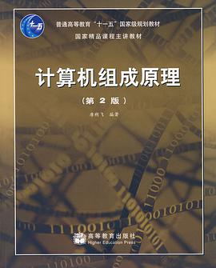
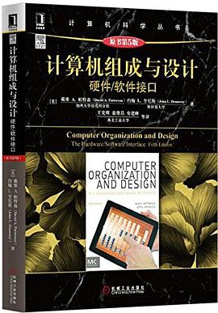

# 计算机组成原理

## 参考书籍

## 相关视频

* [计算机组成原理（上）](https://www.icourse163.org/course/HIT-309001)
* [计算机组成原理（下）](https://www.icourse163.org/course/HIT-1001527001)
* [计算机组成](https://www.icourse163.org/course/PKU-1205809805)

