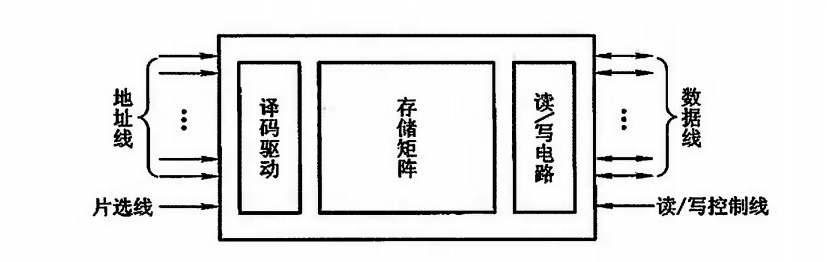
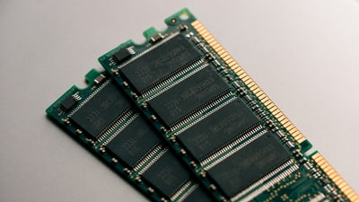
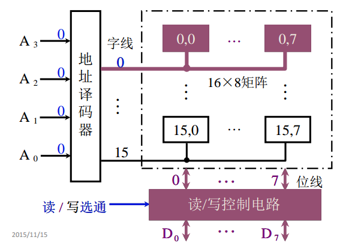
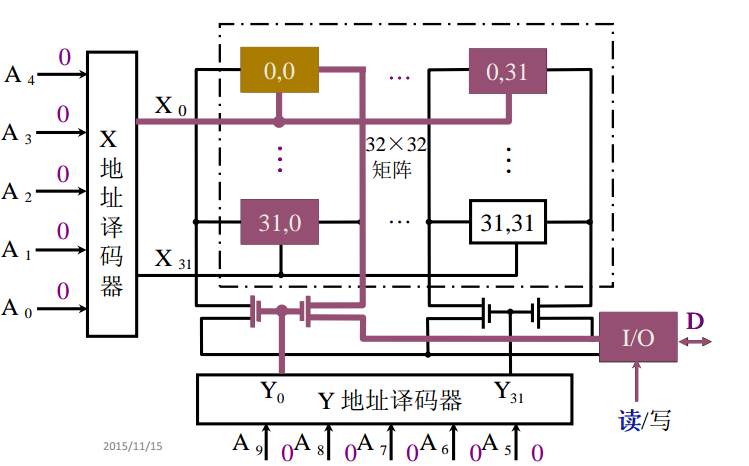
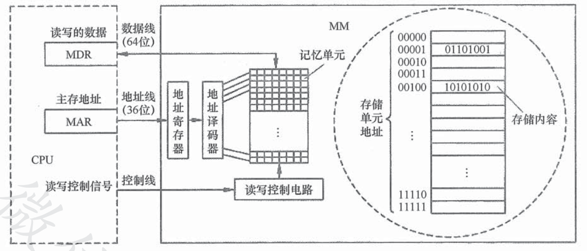

# 半导体存储芯片

## 半导体存储芯片基本结构

半导体存储芯片采用超大规模集成电路，在一个芯片内集成具有记忆功能的**存储矩阵、译码驱动电路和读写电路。**

* **译码驱动**：把地址总线发送来的地址型号翻译成对应存储单元的选择信号，配合读写电路完成选中单元的读写操作
* **读写电路**：包括读出放大器和写入电路，用来完成读写

存储芯片通过地址总线、数据总线和控制总线与外部连接

* **地址线：**单向输入，其位数与芯片容量有关。CPU 给出地址，经过译码驱动找到指定存储单元，完成读写操作
* **数据线：**双向的，其位数与芯片可读出或写入的数据位数有关。

地址线和数据线的位数共同反映了存储芯片的容量。假设地址线为 10 根，数据线为 4 根，则芯片容量为 $$2^{10}*4=4K$$ 

* **读写控制线：**决定芯片进行读写操作，如果用一根线表示 $$\overline{WE}$$ \(低电平写，高电平读\)，两根线表示 $$\overline{OE}$$ （读操作）和 $$\overline{WE}$$ \(写操作\)
* **片选线：**用来选择存储芯片，比如下图是现代计算机中的内存条图片。

其中内存条的每一个黑色芯片就是一个存储芯片，所以一般的内存条包含多个存储芯片，假设一个存储芯片是 1G ，则一个内存条包含 8 个这样的芯片，则这个内存条存储大小就是 8 G。

假设我们需要读取的数据在第二块芯片上，也就是说我们只希望第二块芯片工作，其他的存储芯片不能工作，就需要让第二块芯片的片选线信号有效。

半导体芯片它的片选线一般有两种标示方式：

*  $$\overline{CS}$$ ：**低电平有效**，意思就是如果是低电平，则存储地址就在当前存储芯片当中
* $$\overline{CE}$$ ：芯片的矢能信号

## 半导体存储芯片的译码驱动方式


**所谓译码驱动方式就是给出了存储地址，怎么找到存储单元？**


### 线选法

上图中 A0-A3 共 4 位地址，说明有 2^4 = 16 个存储单元。D0-D7 共 8 位，表示一个存储字长是 8 为，即上图的存储器是 16 \* 8 矩阵

图中输入是 4 根线，输出是 16（2^4） 根线，给定一个输入在输出一端只有一根线是有效的，它的信号会控制相应的存储单元中的存储元件，进行数据输入和输出。

假设给出的地址是全 0 ，通过译码器之后，只有 0 号字线是有效的，其他都是无效的，如果此时是读操作，则读信号会使得控制电路读通路打开，使得数据能够从存储矩阵送到数据总线上

### 重合法

重合法布局是把存储单元布局为一个二维的阵列，把地址分为行列地址，并且分别就进行译码，行地址和列地址只能有一条是有效的。

对于上图中 X 地址 A0-A4 共 5 位地址，输入是 5 根线，输出是 32 根线，同理 Y 地址也需要 32 根，便可以选择 32\*32 矩阵中任一位。

如果当地址线全 0 时，行地址译码器经过译码后只有 X0 选择线有效，对于列地址经过译码后只有 Y0 选择线有效，则 0,0 号地址单元就可以输出送到数据线上。其实 0,31 也会输出，但是数据线为导通是无效的，同理 31,0 也会输出无效


对于线选法和重合法，假设地址线 20 条，对于线选法译码出来的线是 2^20 = 1M 条，而对于重合法，可以分别在 X,Y 各分担 10 条，则每个译码器译码出来的线 2^10 = 1K 条，合起来共 2K 条，比线选法少很多，芯片集成度比较高。


### 

### 

### 

### 

### 

### 

### 

### 

### 寻址

现代计算机通常按字节编址，即每个字节对应一个地址，表示一个存储单元，8 个存储元。

如果采用 64 位数据线，在字节编址方式下，每次最多可以存取 8 个存储单元的内容。也就是一个存储字的大小。

指令执行过程需要访问主存是，CPU 首先把被访问的单元地址发送到 MAR 中，然后通过地址线，将主存地址送到主存中的地址寄存器，以便地址译码器进行译码选中的单元，同时 CPU 将读写信号通过控制线送到主存的读写控制电路。

如果是写操作，那么 CPU 同时将要写的信息发送到 MDR 中，在读写控制电路的控制下，经数据线将信号写入选中的单元

如果是读操作，那么主存读出选中单元的内容发送到数据线，然后送到 MDR 中。

一般情况下，数据线的宽度和 MDR 的宽度相同，地址线的宽度和 MAR 的宽度相同。

上图采用 64 位数据线，在字节编址方式下，每次最多可以存取 8 个存储单元的内容。

