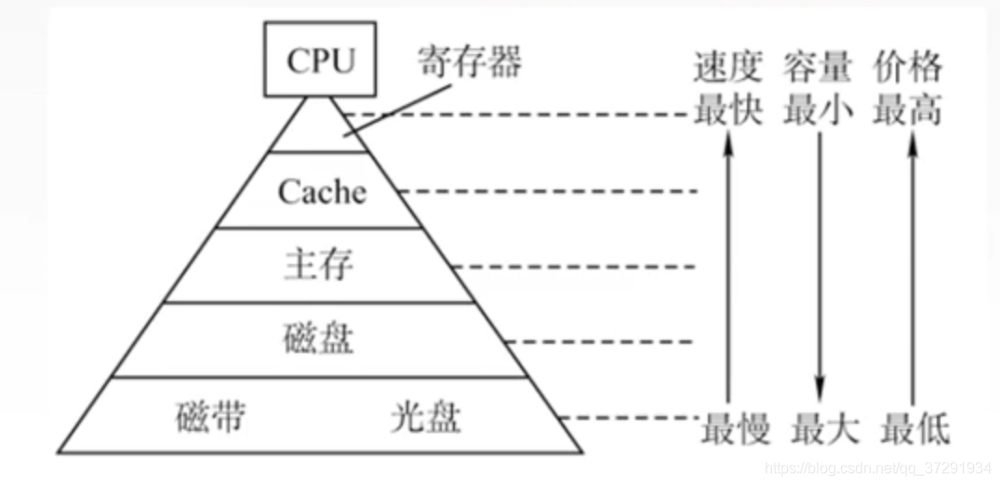
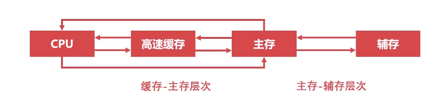

# 存储器层次结构

## 存储器分类

### **按照存储介质分类**

存储介质只能存放 0，1两种代码

* 半导体存储器：存储元件由半导体器件组成的存储器
  * 体积小、功耗低、存取时间短、易失
  * 内存、U盘、固态硬盘
* 磁存储器：在金属或塑料表面涂抹一层磁性材料作为记录介质
  * 磁带、磁盘
* 光盘存储器：应用激光在记录介质上进行读写

### 按照存取方式分类

* 随机存储器（RAM）：随机读取，存取时间与存储单元的物理位置无关
* 只读存储器（ROM）：只读不写，例如：BIOS
* 顺序存取存储器（SAM）：存储单元读写时需要按照物理位置的先后顺序寻找地址，例如：磁带
* 直接存取存储器（DAM）：即有随机存取特性，又有顺序存取特性，先直接选取信息所在区域，然后按顺序方式存取。比如：磁盘

### 按照计算机作用分类

* 主存储器
  * RAM
  * ROM
* 辅助存储器
  * 磁盘
  * 磁带
  * 光盘
* 缓冲存储器（Cache）

## 存储器的层次结构

上图的存储器的层次化结构，其中寄存器处于 CPU 内部，Cache 也称为高速缓冲存储器，实际就是 CPU 的内部的 L1缓存、L2缓存、L3缓存等等，主存就是我们一般说的内存，而磁盘又称为辅存，磁带、光盘称为外存。 

### 缓存-主存层次

* 解决了 CPU 和 主存速度不匹配的问题，数据的调用是由**硬件自动完成**的
* 局部性原理

局部性原理是指 CPU 访问存储器时，无论是存取指令还是存取数据，所访问的存储单元都趋于聚集在一个较小的连续区域中。

因此可以把程序经常访问的内存加载到缓存，从而提高信息访问速度

### 主存-辅存层次

* 实现虚拟存储系统，解决主存的容量问题，数据的调用由**硬件**和**操作系统**共同完成

例如：一个 20 G 的游戏能够在 8G 的内存运行，只是把所需要的数据加载到内存

