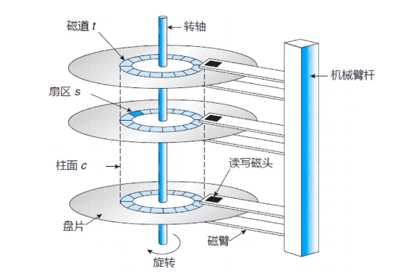
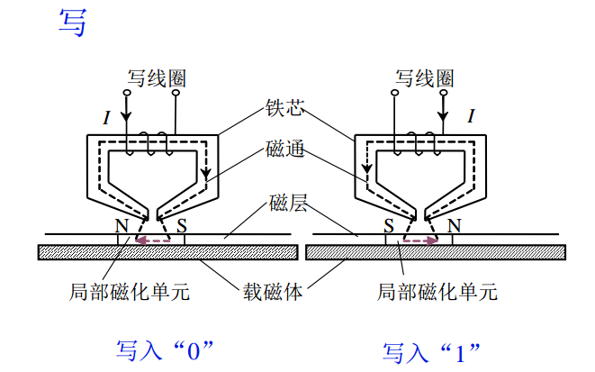
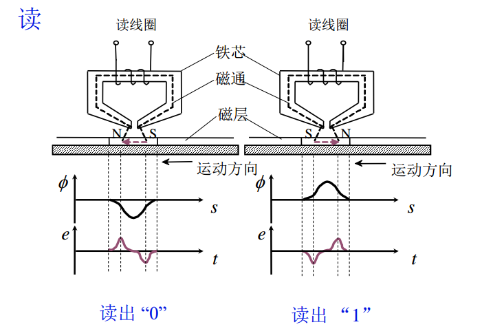
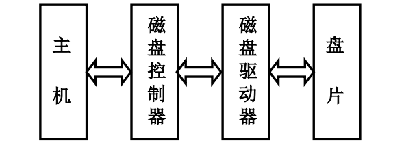
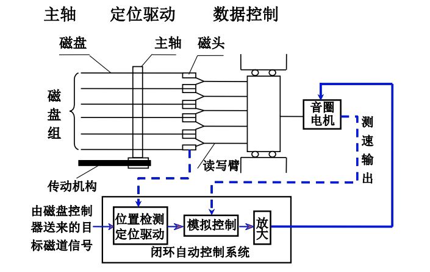

# 辅助存储器

辅助存储器又称为外部存储器，简称外存，它与主存一起组成了存储系统的主存－辅存层次。

其特点是：容量大，价格低，非易失性存储器，但是速度较慢，且无法直接和 CPU 交换信息。

目前广泛应用的辅助存储器都是**磁表面存储器**，工作是靠磁体高速运动，有磁头在磁层上进行读写操作，信息被记录在磁层上，这些信息的轨迹就是**磁道，每个磁道就是一个同心圆**

### 磁表面存储器的技术指标

* **记录密度**：指单位长度内所存储的二进制信息量

磁盘存储器用**道密度**和**位密度**表示。磁盘沿半径方向单位长度的磁道数为道密度，单位长度磁道能记录二进制信息的位数，称为位密度

* **存储容量**：外村所能存储的二进制信息总数量，一般以位或字节为单位

计算公式： $$C=n*k*s$$ \(C 为存储总容量，n 为存放信息的盘面数量，k 为每个盘面的磁道数，s 为每条磁道上记录的二进制代码数\)

* **平均寻址时间**

磁盘采用直接存储方式，寻址时间分为磁头寻找目标磁道的时间和磁头等待欲读写磁道区的旋转到磁头下方的所需的时间。

* **数据传输率**：单位时间内磁表面向主机发送数的位数或字节数，与记录密度有关
* **误码率**：衡量磁表面存储器出错概率的参数，为了减少出错率，磁表面存储器通常采用**循环冗余码**来发现并纠正错误

## 磁记录原理和记录方式

通过线圈通上不同方向的电流，在铁芯内部就会产生不同方向的磁通，会把载磁体表面的磁层进行磁化，磁化方向的不同就可以用来区分写入的 0 还是 1

磁载体表面进行了磁化，在读的过程总，硬盘旋转磁层在运动，下面的磁场经过读写头就会切割磁力线，在读线圈上产生了电流，磁通发生变化，电势发生了变化，电势的不同便可读出 0 和 1

## 硬磁盘存储器

硬磁盘存储器的类型 ：

1. 固定磁头和移动磁头
2. 可换盘和固定盘

硬磁盘存储器结构

### 磁盘驱动器

图中主轴有 6 片磁盘，主轴受传动机构控制，可使磁盘组做高速旋转动作。磁盘组共有 10 个有效记录面，每一面对应一个磁头，10 个磁头分装在读写臂，练成一体固定在小车上。在音圈电机带动下，小车平行移动，带着磁头作判的径向运动，以便找到目表磁道。

### 磁盘控制器

* 接收主机发来的命令，转换成磁盘驱动器的控制命令
* 实现主机和驱动器之间的数据格式转换
* 控制磁盘驱动器读写，磁盘控制器是主机与磁盘驱动器之间的接口：
  * 对主机通过总线
  * 对硬盘（设备）

### 盘片

由硬质铝合金材料制成

