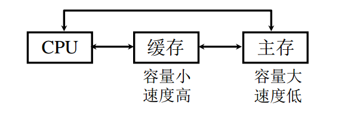
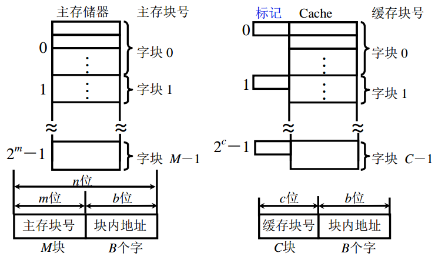

# 高速缓冲存储器

## 为什么要用 Cache

在并行存储系统中，由于 I/O 设备向主存请求的级别高于 CPU 访存，导致 CPU 等待 I/O 设备访存的现象，使得 CPU 空等一段时间，降低了 CPU 的工作效率。

为了解决 CPU 空等问题，在 CPU 和 主存之间接一块小的设备－缓存，使用静态 RAM 制作

为了充分发挥 Cache 的能力，必须保证 CPU 访问的指令和数据大多数情况下都可以在 Cache 中得到，需要依靠**程序访问的局部性原理**

**程序访问的局部性原理包含两个方面：**

* **时间局部性：当前正在使用的数据或指令在不久的将来还会被使用到，就应当把正在使用的指令和数据存放到 Cache，等到将来使用直接从 Cache 取出**
* **空间局部性：当前正在使用的数据或指令在不久的将来相邻的指令和数据可能被用到，这样就应该把正在使用的指令和数据存放到 Cache，同时把相邻的指令和数据也放入到 Cache**

## **Cache 工作原理**

把主存储器和 Cache 分成**大小相等的块**，主存是 M 块，Cache 是 C 块，Cache 容量 C 远远小于主存的容量 M

