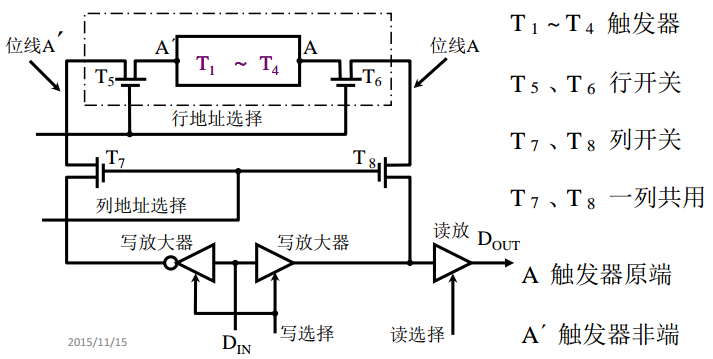
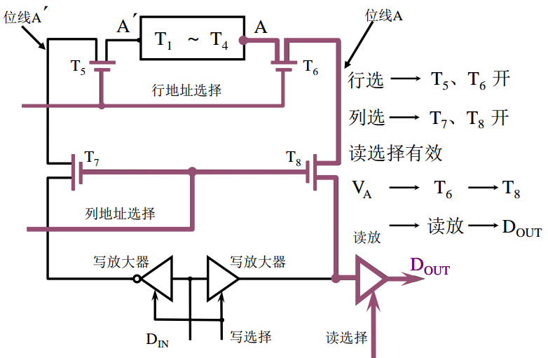
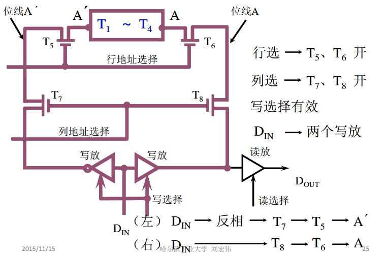

# 随机存取存储器

## 静态 RAM（SRAM）

### 静态 RAM 基本电路　

存储器用于寄存 0 和 1 代码的电路称为存储器的基本单元电路，下图是有 MOS 管组成的基本单元电路

T1-T4 是由 MOS 管组成的触发器基本电路，存储信息

T5、T6 犹如开开关，受行地址选择信号控制。T1-T6 共同构成了一个基本单元电路

T7、T8 受列地址选择信号控制

### 静态 RAM 基本电路的读操作

### 静态 RAM 基本电路的写操作


静态RAM 保存 0 和 1 用的是[**双稳态触发器**](https://baike.baidu.com/item/%E5%8F%8C%E7%A8%B3%E6%80%81%E8%A7%A6%E5%8F%91%E5%99%A8)，动态 RAM 利用的是电容，电容中保存了电荷就认为存储的信息就是 1，电容中没有被充电就认为存储的信息就是 0


## 动态 RAM（DRAM）

### 动态 RAM 基本单元电路

