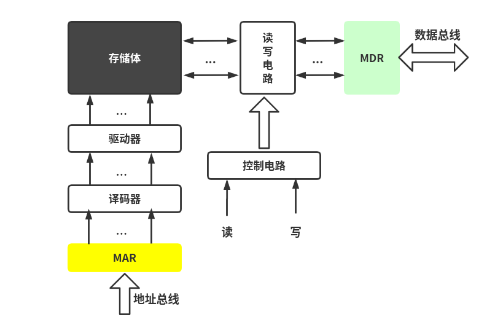
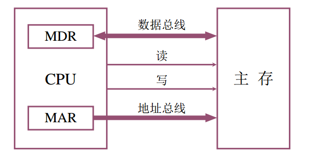
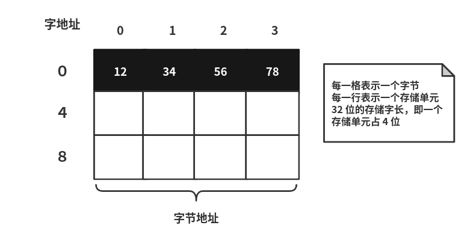
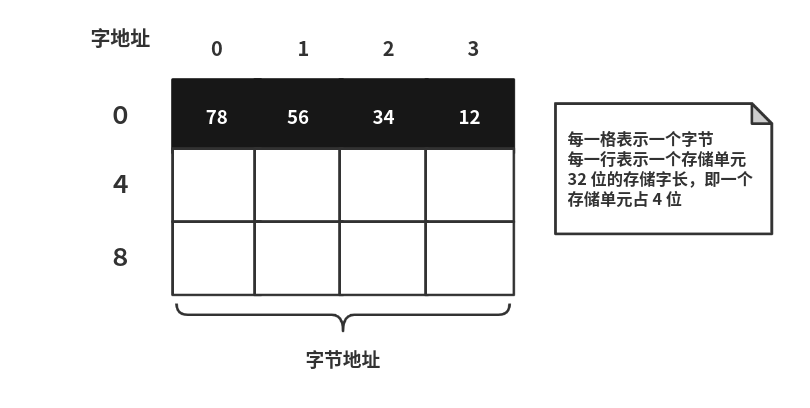

# 主存储器基本组成

## 主存储器的构成

主存储器有存储体、MAR、MDR组成（现代计算机已经把 MAR 和 MDR 集成在 CPU 内），三者会在时序控制逻辑电路下配合工作。

存储体是用来存放程序和数据的地方，存储体中的最基本单位就是二进制位，每一位可存放一个数字 0 或者 1，表示一个**存储元**。若干个存储元组成一个**存储单元**（8bit，即一个字节），许多存储单元组成一个存储器。

## 主存的基本组成

下图是一个更加细化的主存结构

MAR 保存了某个存储单元的地址，需要经过译码器进行译码之后选定存储单元。MDR 保存了需要读出或者需要写入的数据，对于数据到底是读出还是写入有读写电路和控制电路进行控制。如果是写入的话就把 MDR 中数据送到 MAR 指定的存储单元当中，如果是读出则把 MAR 指定存储单元的数据送到 MDR 中

## 主存和 CPU 之间的联系

主存和 CPU 之间通过数据总线、控制总线、地址总线连接。

* 数据总线：完成 CPU 和主存的数据传输，直接连接在 MDR 寄存器上，双向的，可读可写
* 地址总线：连接在 MAR 寄存器，给出要访问存储单元的地址，单向的，由 CPU 到主存
* 控制总线：读出或者写入

## 主存中存储单元地址的分配

假设存储单元的存储字长是 32 位，主存的编址单位是字节，每一个字节对应一个地址，一个字节是 8 位，所以一个存储字包含了 4 个字节

12345678H 这个数据如何在主存储器中进行存储？

12345678H 十六进制，用二进制表示每一位占 4 位，刚好 32 位，保存在一个存储单元当中

* **高位字节地址为字地址**

图中可以看出，12345678 H 的高位存放在低地址，比如 12 处于高位，但是其存放在 0 号地址。并且把高位所在的地址作为存储字的地址，这种存储方式称为**大端方式**或**大尾方式**

* **低位字节地址为字地址**

上图把 12345678H 的低位存放在低地址，比如 78 处于低位，其存放在 0 号地址。并且把低位所在的地址作为存储字的地址，这种存储方式称为**小端方式**或**小尾方式**

## 主存技术指标

* 存储容量：主存 存放二进制代码的总位数
* 存储速度：
  * 存取时间：存储器的访问时间
  * 存取周期：连续两次独立的存储器操作（读或写）所需的 最小间隔时间
* 存储器的带宽：位/秒

