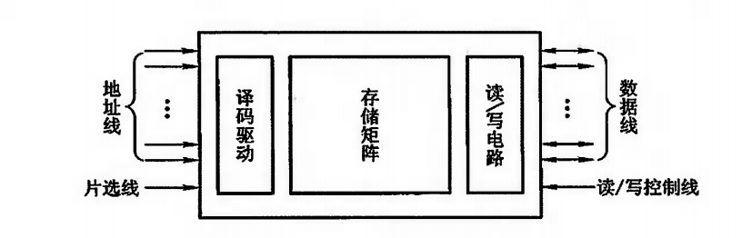
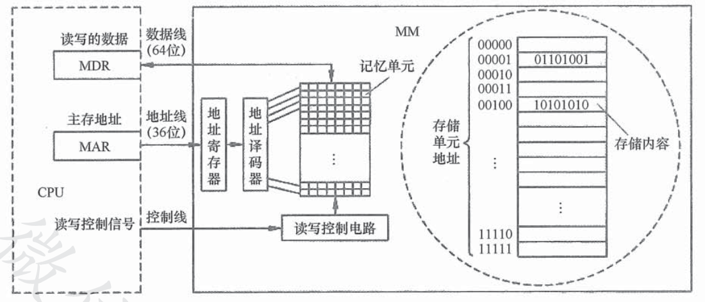

# 主存储器基本组成

主存储器有存储体、MAR、MDR组成（现代计算机已经把 MAR 和 MDR 集成在 CPU 内），三者会在时序控制逻辑电路下配合工作。

存储体是用来存放程序和数据的地方，存储体中的最基本单位就是二进制位，每一位可存放一个数字 0 或者 1，表示一个**存储元**。若干个存储元组成一个**存储单元**（8bit，即一个字节），许多存储单元组成一个存储器。

## 半导体存储芯片

半导体存储芯片采用超大规模集成电路，在一个芯片内集成具有记忆功能的**存储矩阵、译码驱动电路和读写电路。**

* 译码驱动：把地址总线发送来的地址型号翻译成对应存储单元的选择信号，配合读写电路完成选中单元的读写操作
* 读写电路：包括读出放大器和写入电路，用来完成读写

存储芯片通过地址总线、数据总线和控制总线与外部连接

* 地址线是单向输入，其位数与芯片容量有关
* 数据线双向的，其位数与芯片可读出或写入的数据位数有关。

地址线和数据线的位数共同反映了存储芯片的容量。假设地址线为 10 根，数据线为 4 根，则芯片容量为 $$2^{10}*4=4K$$ 

* 读写控制线决定芯片进行读写操作
* 片选线用来选择存储芯片，比如下图是现代计算机中的内存条图片。

其中内存条的每一个黑色芯片就是一个存储芯片，所以一般的内存条包含多个存储芯片，假设一个存储芯片是 1G ，则一个内存条包含 8 个这样的芯片，则这个内存条存储大小就是 8 G。

假设我们需要读取的数据在第二块芯片上，也就是说我们只希望第二块芯片工作，其他的存储芯片不能工作，就需要让第二块芯片的片选线信号有效。

### 寻址

现代计算机通常按字节编址，即每个字节对应一个地址，表示一个存储单元，8 个存储元。

如果采用 64 位数据线，在字节编址方式下，每次最多可以存取 8 个存储单元的内容。也就是一个存储字的大小。

指令执行过程需要访问主存是，CPU 首先把被访问的单元地址发送到 MAR 中，然后通过地址线，将主存地址送到主存中的地址寄存器，以便地址译码器进行译码选中的单元，同时 CPU 将读写信号通过控制线送到主存的读写控制电路。

如果是写操作，那么 CPU 同时将要写的信息发送到 MDR 中，在读写控制电路的控制下，经数据线将信号写入选中的单元

如果是读操作，那么主存读出选中单元的内容发送到数据线，然后送到 MDR 中。

一般情况下，数据线的宽度和 MDR 的宽度相同，地址线的宽度和 MAR 的宽度相同。

上图采用 64 位数据线，在字节编址方式下，每次最多可以存取 8 个存储单元的内容。

