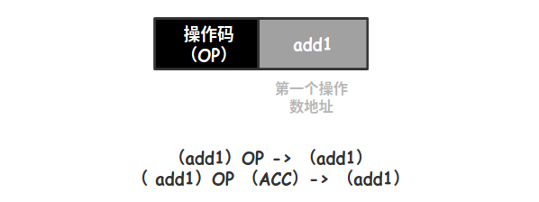
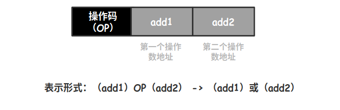
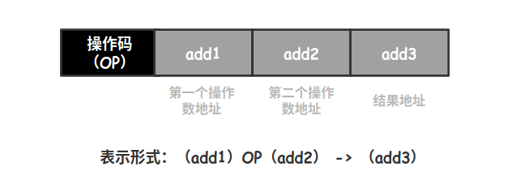
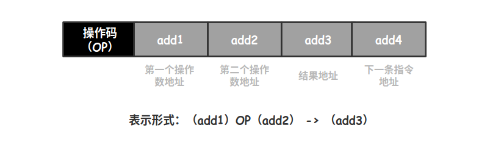

# 地址指令

## 机器指令

机器指令由操作码字段和地址码字段组成：

* **操作码**

用来指明该指令所要完成的操作，例如：加法、减法、移位等，其**位数反应了机器的操作种类，假设操作码有 7 位，则机器最多包含 2^7 = 128 条指令**

* **地址码**

指出该指令的源操作数的地址、结果地址以及下一条指令地址，地址码的不同也可以分为四地址指令、三地址指令、二地址指令、一地址指令、零地址指令

### 零地址指令

1. 不需要操作数，如空操作、停机、关中断
2. 堆栈计算机，两个操作数隐含存放在栈顶和次栈顶，计算结果压回栈顶。比如：后缀表达式

### 一地址指令

需要两个操作数，其中一个操作数隐含在某个寄存器中，比如隐含在 ACC。

### 二地址指令

