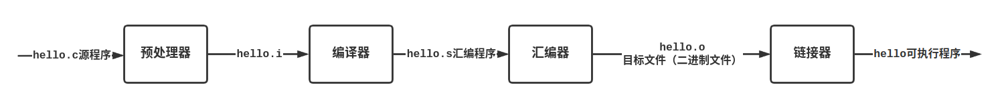
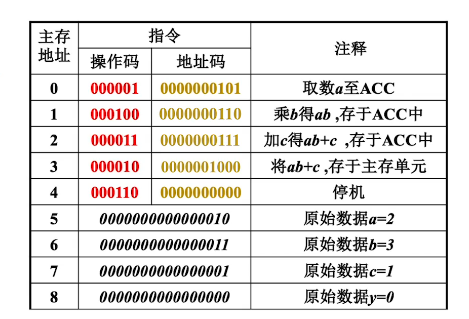
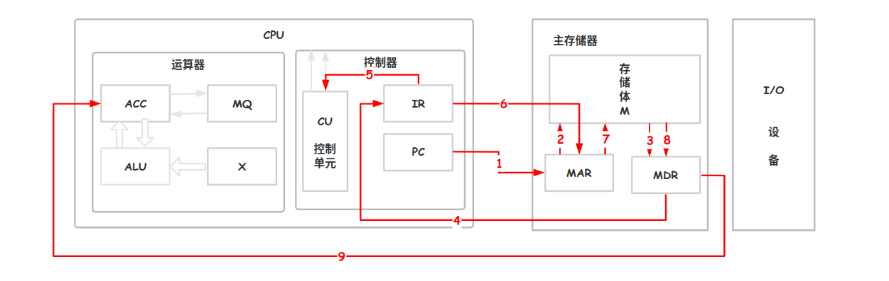
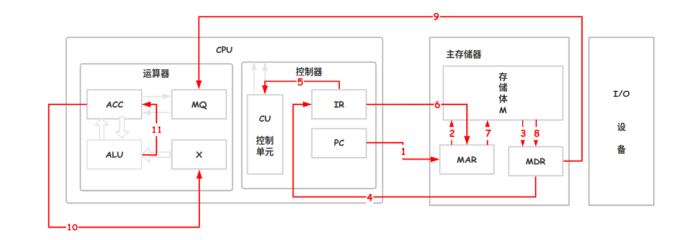
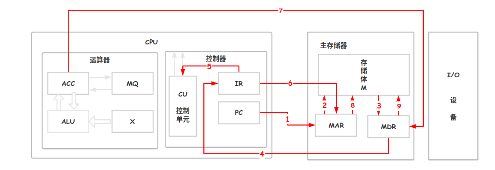

# 计算机的工作过程

计算机的工作过程分为以下三个步骤：

1. 将数据和程序加载到主存储器
2. 将源程序转换为可执行文件
3. 从可执行文件的首地址开始逐条执行指令



存在以下 C 语言代码，分析代码执行过程：

```c
int a=2,b=3,c=1,y=0;
void main(){
    y = a * b + c;
}
```

高级语言编译成机器语言，对应内存结构如下：





1. PC 指向 0 ，指向第一条指令的地址。
2. 通过地址总线传送`(PC)-> MAR`，导致 （MAR）= 0，同时控制器通过控制总线告诉主存储器要进行 Read
3. 主存储器根据 MAR 记录的地址信息，去存储体找出 0 号地址的数据并存放到 MDR。`M(MAR)-> MDR`，`(MDR)= 000001 0000000101`
4. 通过数据总线把指令放到 IR 中`(MDR)-> IR`，导致`(IR) = 000001 0000000101`
5. 把指令中的操作码送到 CU ，`OP(IR)-> CU`，CU 分析得知，这是**取数**的指令
6. 把指令中的地址码放到 MAR 中，`Ad(IR) -> MAR`，导致 \(MAR\) = 5
7. 主存储器根据 MAR 地址找到存储体中 5 号单元的数据
8. 把数据放到 MDR。`M(MAR)-> MDR`，`(MDR)= 000000000000010 = 2`
9. MDR 数据传送到 ACC ，`(MDR) -> ACC`，导致 `(ACC) = 000000000000010 = 2`

**上一条指令取指后 PC 自动加 1 ，`(PC) = 1`，执行之后`(ACC) = 2`，接下来执行第二条指令：**



1. \(PC\) = 1，\(ACC\) = 2
2. \(PC\) -&gt; MAR，\(MAR\) = 1
3. Ｍ\(MAR\) -&gt; MDR，导致 \(MDR\)  = 000100 0000000110
4. \(MDR\) -&gt; IR，\(IR\) = 000100 0000000110
5. OP\(IR\) -&gt; CU，指令**操作码**送到 CU，分析得知是**乘法**指令
6. Ad\(IR\) -&gt; MAR，指令的地址码送到 MAR，导致\(MAR\) = 6
7. 主存储器根据 MAR 地址找到存储体中 6 号单元的数据
8. M\(MAR\)-&gt; MDR，\(MDR\)= 000000000000011 = 3
9. MDR 数据传送到 MQ ，`(MDR) -> MQ`，导致 `(MQ) = 000000000000011 = 3`
10. \(ACC\) -&gt; X，导致 \(X\) = 2，乘法运算，把被乘数放到 X 寄存器
11. CU 通过控制总线告诉 ALU 进行乘法运算，ALU 把 X 和 MQ 相乘结果放到 ACC，导致 \(ACC\) = 6，如果乘积太大，需要 MQ 辅助存储，存放结果的**低位**

**重复上面的步骤，直到指令运行赋值语句，存储数据：**



步骤 1-4 都一样，直到第五步：

* CU 解析操作码 OP\(IR\) -&gt; CU，发现是一个**存数**的操作
* 接着把**地址码**送到 MAR ，Ad\(IR\) -&gt; MAR，指明存放数据的地址
* \(ACC\) -&gt; MDR，把 ACC 的数据通过数据总线送到 MDR，MDR 指明存放运算结果
* CU 通过控制总线告诉主存储器需要存写的操作，主存储器会根据 MAR 的地址把 MDR 中的数据放到相应位置

