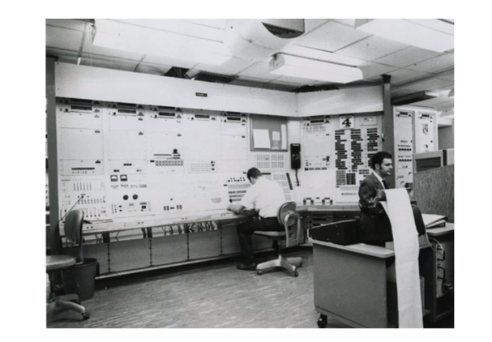
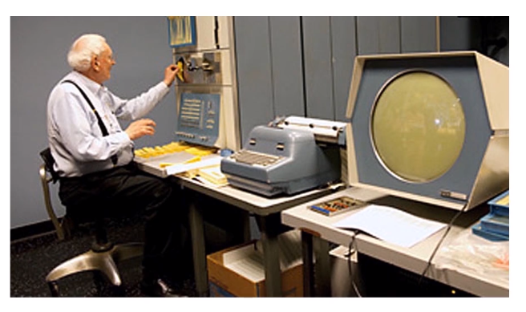
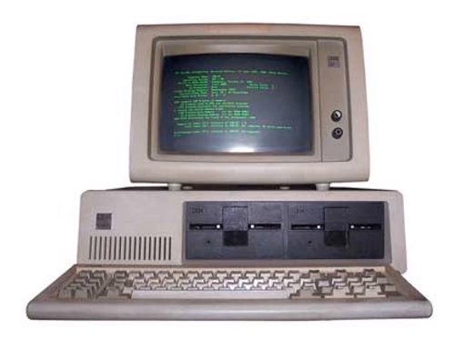
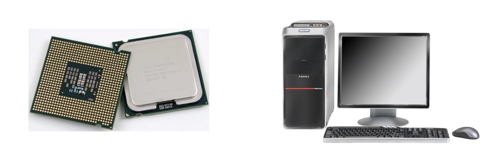

# 计算机的发展历史

## 计算机硬件发展

### 第一代电子管计算机（1945-1955）

1946 年诞生于宾夕法尼亚大学，由 Mauchley 和 Ecket 设计研制 **ENICA** （电子数字综合器和计算机）设计**用于计算火炮的弹道**  

ENICA 由 18000 个电子管和 1500 个继电器组成，重 30 吨，耗电 140 千瓦。体系结构上由 20 个十进制数寄存器，每个能存放一个十进制数。通过设置 6000 个开关和其他众多的插头插座来编程，每秒可进行 5000 多次加法运算。

**ENICA 计算机特点：**

* 集成度小，空间占用大
* 功耗高，运行速度慢
* 操作复杂，更换程序需要换线

ENIAC 顾问冯诺依曼发现 ENIAC 的开关定位和转插线只不过代表一些数字信息，完全可以像受程序管理的数据一样，存放于主存储器中。也就是**存储程序**的概念，即将程序和数据一起存放在存储器中。

之后研究小组并开始新的设计 EDVAC，在 EDVAC 的设计中，实现了存储程序的概念，同时将指令和数据采用二进制而非 ENIAC 的十进制，并且清晰的指明了五个基本组成部分。

但是由于小组闹掰了，研究停滞。冯诺依曼离开了宾夕法尼亚大学，回到普灵斯顿研究院研制他自己的 EDVAC ，即 **IAS** 机。但是由于种种原因 IAS 未能问世，但是其总体结构得到了认可，并成为后来通用计算机的原型。

* 存储器
* 运算器（算术逻辑部件ALU）
* 控制器
* 输入、输出设备

### 第二代晶体管计算机（1955-1965）

贝尔实验室发明了晶体管，替代了电子管  。第一台晶体管计算机 **TX-0** 诞生于麻省理工的林肯实验室。

再后来由 DEC \(数字设备公司\)在 1957 年制造出了类似 TX-0 的商业机 **PDP-1（第一台小型计算机）**，配有 4K 内存，字长 18 位，每秒能够执行 200 000 条指令。采用总线结构，开创了计算机产业

**晶体管计算机特点：**

* 集成度相对较高，空间占用较小
* 功耗相对较低，运行速度较快
* 操作相对简单，交互更加方便

### 第三代集成电路计算机（1965-1980）

利用硅集成电路使得单个芯片可集成几十个晶体管。之后出现第一个系列计算机：**IBM System/360**，主要用于科学计算和商务计算。

**集成电路计算机特点：**

* 计算机体积更小
* 功耗更低
* 计算速度更快

### 第四代超大规模集成电路计算机（1980年至今）

到 20 世纪 80 年代，超大规模集成电路（VLSI）的出现，使得一个芯片上集成几万、几十万甚至上百万个晶体管。使得计算机更加小型化，速度更块。

而这个时代的乔布斯发布的 Apple 和 Apple 二代在家庭和学校更是非常受欢迎。

**超大规模集成电路计算机特点：**

* 一个芯片继承上百万晶体管
* 速度更快，体积更小
* 用途更广

## 计算机软件发展

* 第一代电子管计算机：使用机器语言编程，没有操作系统
* 第二代晶体管计算机：出现了高级语言 FORTRAN，有了操作系统的雏形
* 第三代集成电路计算机：有了高级语言 C，开始出现了分时操作系统
* 第四代超大规模集成电路：出现更加高级的语言 C++、Java

