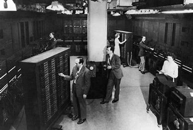
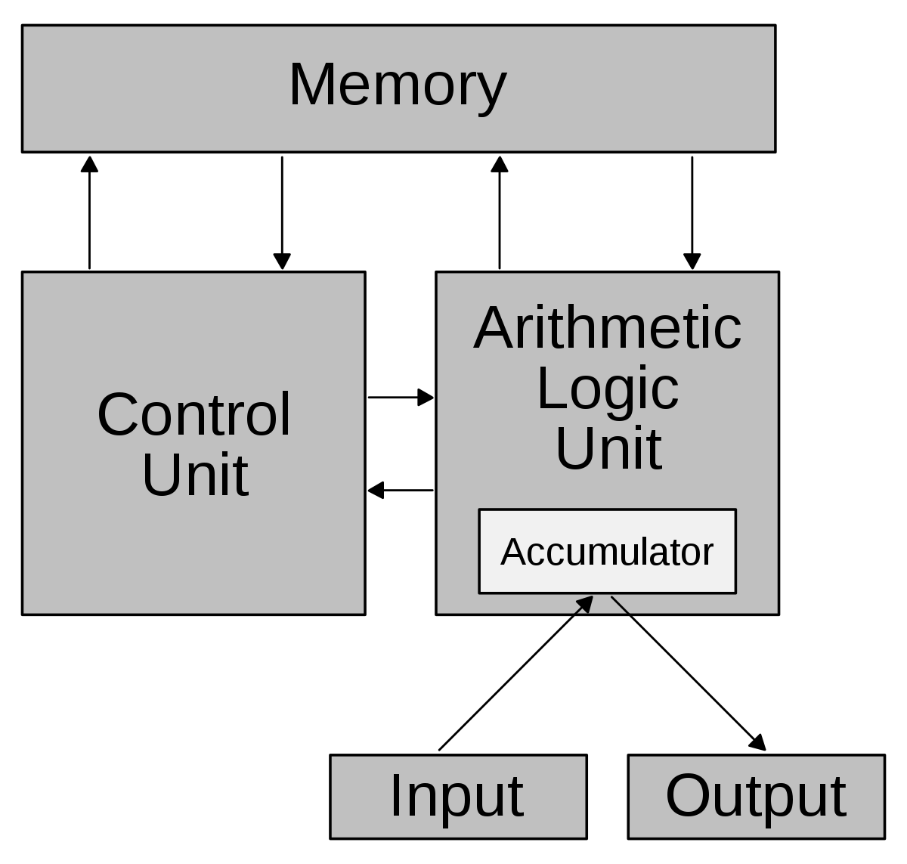
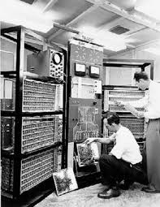
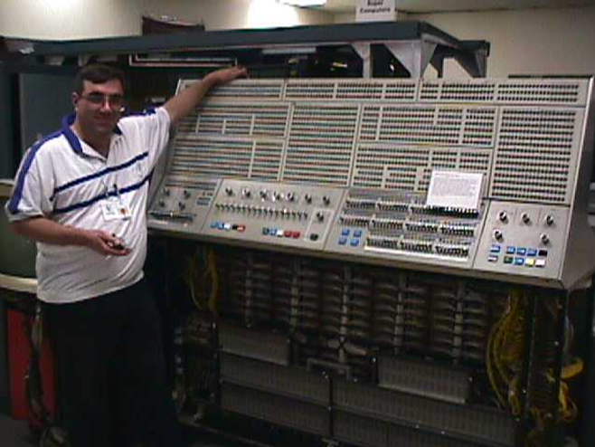
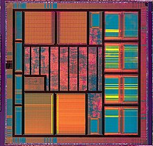

# 计算机发展里程碑

## 第一代电子管计算机（1945-1955）

Mauchley 和 Ecket 设计研制 **ENICA** （电子数字综合器和计算机）设计用于计算火炮的弹道  

ENICA由 18000 个电子管和 1500 个继电器组成，重 30 吨，耗电 140 千瓦。体系结构上由 20 个十进制数寄存器，每个能存放一个十进制数。通过设置 6000 个开关和其他众多的插头插座来编程。

### 冯 · 诺依曼机

冯诺依曼发现用大量的开关、插头编程十分费时且不灵活，提出程序可以用数字形式和数据一起在计算机内存中表示。对 ENICA 用 10 个电子管（1 个亮，9 个不亮）表示一位十进制数的方式通过使用二进制数表示替代。

冯诺依曼机由五个基本部分：  

* 存储器
* 运算器（算术逻辑部件ALU）
* 控制器
* 输入、输出设备

存储器有 4096 个字，每个字 40 位，每位都是 0 或 1，每个字表示两条 20 位指令或一个 40 位的**有符号整数**。

指令中的 8 位用来区分指令类型，另外 12 位表示 4096 个存储单元中的一个地址。

算术逻辑部件中有一个特殊的 40 位内部寄存器－**累加器，**典型的指令将内存中的一个字和累加器相加或将累加器的内容存放在内存中，但是**该机不提供浮点运算**

## 第二代晶体管计算机（1955-1965）

贝尔实验室发明了晶体管，替代了电子管  。后来有 DEC \(数字设备公司\)在 1957 年制造出了商业机－**PDP-1（第一台小型计算机）**，配有 4K 内存，字长 18 位，每秒能够执行 200 000 条指令。采用总线结构，开创了计算机产业

## 第三代集成电路计算机（1965-1980）

利用硅集成电路使得单个芯片可集成几十个晶体管。之后出现第一个系列计算机：**IBM360**，主要用于科学计算和商务计算

## 第四代超大规模集成电路计算机（1980年至今）

到 20 世纪 80 年代，超大规模集成电路（VLSI）的出现，使得一个芯片上集成几万、几十万甚至上百万个晶体管。使得计算机更加小型化，速度更块。

