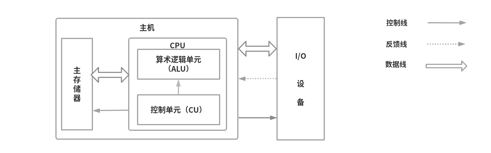
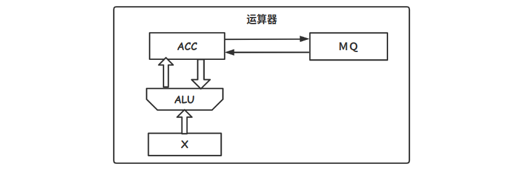

# 计算机的基本组成

## 冯·诺依曼计算机

* 运算器：算术运算和逻辑运算，存储中间计算结果
* 存储器：存放数据和程序
* 控制器：指挥程序运行
* 输入设备：程序和数据以机器所识别的信息输入计算机
* 输出设备：机器识别信息转换人们熟悉信息

**冯·诺依曼计算机特点**

* 计算机由**运算器、控制器、存储器、输入设备、输出设备**组成
* 指令和数据存放寄存器内，以地址寻访
* 指令和数据二进制表示
* 指令由操作码和地址码组成
  * 操作码：指明操作性质，例如：加减乘除
  * 地址：操作数据在存储器中的位置
* 指令在存储器按顺序存放
* 以**运算器**为中心

## 现代计算机

现代计算机以**存储器**为中心，通常把运算器和控制器集成，称为**中央处理器（Central Processing Unit，CPU）**。把输入和输出设备简称 **I/O 设备**

现代计算机组成由三大部分组成：CPU、I/O 设备、主存储器，CPU 和主存储器称为主机，I/O 设备称为外部设备。

* 算术逻辑单元（Arithmetic Logic Unit，ALU）：完成算术逻辑运算
* 控制单元（Control Unit，CU）：解释存储器中的指令，并发出操作命令执行指令
* 主存储器：简称主存或内存，包括**存储体、逻辑部件、控制电路。**
* IO 设备也受 CU 控制，用来完成相应的输入和输出操作

## 主存储器

上图中可以得出，主存储器主要由存储体、MAR、MDR 组成。

* **存储体**：用来存放数据
* **MAR（存储器地址寄存器）**：用来存放将要访问的存储单元地址，**位数对应存储单元个数**，例如 10 位，则有 2^10 = 1024 个存储单元，记为 1K
* **MDR（存储器数据寄存器）**：存放从存储体某单元取出的代码或准备存放某单元的代码，**位长与存储字长相等。**例如 MDR=16 位，每个存储单元可存放 16bit （2B）等同于存储字大小，即一个存储单元包含 16 个存储元。

**什么是存储单元、存储字长、存储字、存储元？**

在存储体内部有许多存储单元组成，每个存储单元包含若干个存储元，每个存储元表示 0 或者 1。而每个存储单元的一串二进制代码称为存储字，二进制代码的位数为存储字长。上图中的一个存储单元是 8 个存储元，即 1B，所以存储字长就是 1B 。

主存储器的工作方式是按照存储单元的地址进行存取的：

读取数据：CPU 从主存储器读取数据，先把想要获取数据对应的地址存放在 MAR，接着主存储器就可以根据 MAR 地址去存储体找到对应的数据，并把数据存放在 MDR，最后 CPU 通过数据线路从 MDR 取走数据 

写入数据：CPU 会把想要写入的数据位置（地址）存放在 MAR，把数据存放在 MDR，之后主存储器会把 MDR 中的数据存放在 MAR 在存储器对应的地址位置上

## 运算器

运算器用于实现算术运算，比如：加减乘除、逻辑运算（与或非、异或、移位等），其组成包含若干个通用寄存器，用于暂存操作数和中间结果，主要的寄存器以下几个：

* **ACC（Accumulator）**：累加器，用于存放操作数，或运算结果
* **MQ（Multiplier-Quotient Register）**：乘商寄存器，在乘除运算时，用于存放操作数，或运算结果
* **X**：通用的操作数寄存器，用于存放操作数
* **ALU（Arithmetic Logic Unit）**：算术逻辑单元，通过内部复杂的电路实现算术运算、逻辑运算
* **其他寄存器**：
  * **PSW**：状态字寄存器，存放 ALU 计算得到的一些标志信息或处理机的状态信息，比如：是否溢出，有无进位
  * **BR**：基址寄存器
  * **IX**：变址寄存器

## 控制器

* **程序计数器（Program Counter，PC）**：存放当前想要执行的指令的地址，与主存 MAR 之间有通道，且自动加一形成下一条指令地址
* **指令寄存器（Instruction Register，IR）**：存放当前的指令，内容来自主存 MDR
* **控制单元（CU）**：分析指令，给出控制信号

