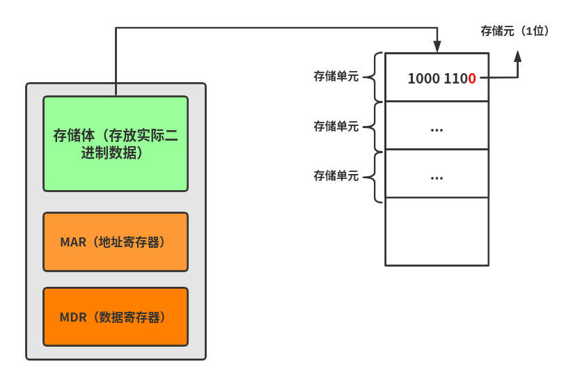

# 计算机硬件的主要技术指标

## 机器字长

机器字长是指 CPU 一次能够处理数据的位数，通常和 CPU 的**寄存器位数**有关。字长越长，数的表示范文越大，精度越高。

## 存储器容量

存储器容量包括**主存容量**和**辅存容量**。

### 主存容量

主存容量指的是主存存放二进制代码的总位数，即**存储容量 = 存储单元个数\*存储字长**


什么是存储单元和存储字长？

了解存储单元先了解**存储元，**存储元就是主存中一个二进制位，要么是 0 要么是 1，而一串存储元组成而二进制串就是**存储字**，这个串的长度就是**存储字长**。一般存储字长为 8 ，即有 8 个二进制位，而这 8 个二进制所在主存的一个空间就是一个**存储单元。**而一般的主存就是有许多的存储单元组成。


上图中 MAR 的位数反映了存储单元的个数，MDR 的位数反映了存储字长。例如，MAR 为 16 位，则可以表示 $$2^{16}=65536$$ 个存储单元，而 MDR 为 32 位，计算总容量为： $$2^{16}*32=2^{21}$$ 位。

现代计算机通常用字节描述容量大小，根据 $$2^{21}$$ 位表示字节为 256KB 大小

### 辅存容量

辅存容量通常用字节表示，例如一个硬盘容量为 80G

## 运算速度

### **CPU 主频**

CPU 主频（时钟信号的频率）就是 CPU 内数字脉冲信号振荡的频率，每个脉冲信号的时间称为时钟周期。Pentium 2GHz 表示时钟信号的频率为 2GHz（1GHz = 10亿次/秒）

### CPI

CPI 表示执行一条指令所需的**时钟周期数**

$$
CPU 执行时间 =\frac{CPU 时钟周期数}{主频} = \frac{(指令条数*CPI)}{主频}
$$

### MIPS

每秒执行几百万条指令

### FLOPS

每秒执行多少次浮点运算

