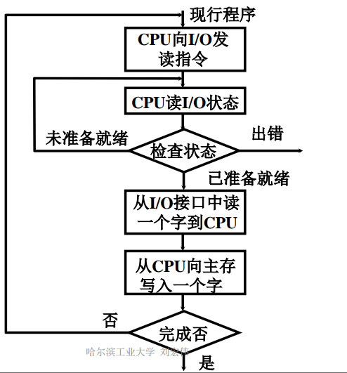
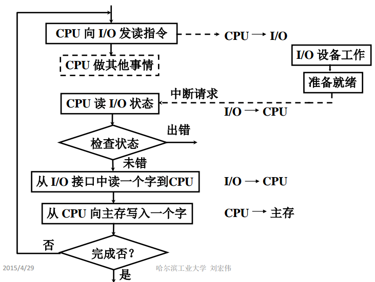
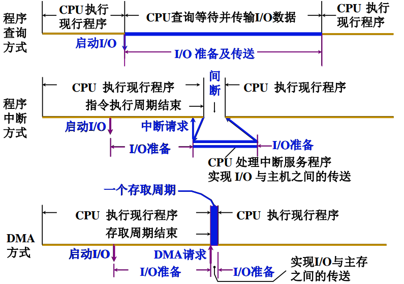

# I/O 控制方式

## 程序查询方式

程序查询方式核心问题就是**每时每刻需要不断查询 I/O 设备是否准备就绪**

通过检查 I/O 控制器中的状态寄存器，检测到已完成之后，再从数据寄存器取出输入数据

## 程序中断方式

等待键盘 I/O 时 CPU 可以先去执行其他程序，键盘 I/O 完成后 I/O 控制器向 CPU 发送中断请求， CPU 响应中断请求，并取走输入数据

## DMA 方式

> DMA：Direct Memory Access **直接内存访问**

DMA 技术就是我们在主板上放⼀块独⽴的芯⽚。在进⾏内存和 I/O 设备的数据传输的时候，我们不再通过 CPU 来控制数据传输，⽽直接通过 **DMA 控制器**（DMAController，简称 DMAC）

主存与高速 I/O 设备之间有一条直接数据通路\(DMA 总线\)，CPU 向 DMA 接口发出读写命令。并指明**主存地址**、**磁盘地址**、**读写数据量**等参数。

之后 CPU 去执行其他程序，接着由 DMA 控制器自定控制磁盘与主存的数据读写，每完成一整块数据读写，才向 CPU 发出一次中断请求。

## 三种方式的 CPU 工作效率比较

