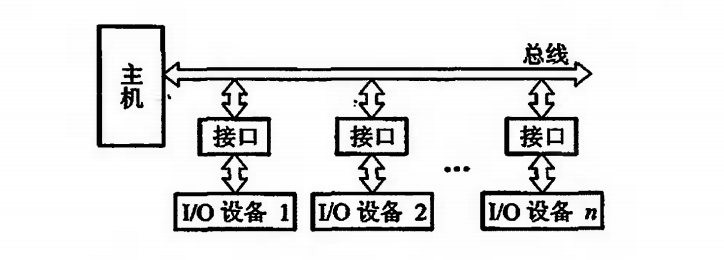
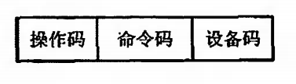

# 输入输出系统的概况

## 输入输出系统的发展概况

* **早期阶段**

I/O 设备与主存交换信息都必须通过 CPU

当 I/O 设备与主机交换信息是， CPU 需要停止运算，CPU 和 I/O 设备 串行工作，**程序查询方式**　

* **接口模块和 DMA 阶段**

I/O 设备通过接口模块与主机相连，采用总线结构

在接口中设有数据通路和控制通路，CPU 和 I/O设备 并行工作，**中断方式**和 **DMA 方式**

* **具有通道结构的阶段**

通道用来负责管理 I/O 设备以及实现主存与 I/O 设备之间交换信息的部件，可视为一种特殊功能处理器，具有专门的通道指令

* **具有 I/O 处理机的阶段**

I/O 处理机又称外围处理机，独立于主机工作，即可以完成 I/O 通道要完成到 I/O 控制，又可完成码制变换、格式处理、数据块检错、纠错

## 输入输出系统的组成

### **I/O 软件**

**I/O 指令**

程序员把 I/O 指令编写到应用程序当中，CPU 执行指令，控制外部设备

* 操作码：表示当前指令为 I/O 操作
* 命令码：表示要对 I/O 设备进行查询、输入、输出等一些控制
* 设备码：I/O 设备编码，即 I/O 设备地址

**通道指令**

通道指令是对具有通道的 I/O 系统专门设置的指令

### I/O 硬件

* 设备通过 I/O 接口连接在总线上和主机完成信息交换
* 采用通道方式，设备连接设备控制器，设备控制器连接子通道，子通道连接通道

## I/O 设备与主机联系方式

### I/O 设备编址

* **统一编址**：把 I/O 设备地址看做是内存地址一部分。假设在 64 K 地址的存储空间中划出 8K 作为 I/O 设备地址，凡是在这 8K 地址范围内访问，就是对 I/O 设备的访问，所有的指令与访存指令相似。
* **不统一编址**：I/O 地址与存储器地址分开，所有对 I/O 设备的访问必须采用专用的 I/O 指令

### 传送方式

* 串行：一位一位的传输，适合远程传输
* 并行：同时有多位数据传输，数据线有多条

### I/O 设备与主机连接方式

* 辐射式：要求每台 I/O 设备都有一套控制线和一组信号线
* 总线式

