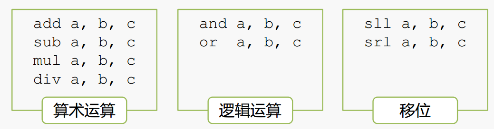

# MIPS

MIPS 指令的主要特点：

* **固定的指令长度**（32-bit，即1 word），简化了从存储器取指令
* 简单的寻址模式，简化了从存储器取操作数
* 指令数量少，指令功能简单，一条指令只完成一个操作，简化指令的执行过程
* 只有 Load 和 Store 指令可以访问存储器

### 运算指令

加法指令

* 格式： add a, b, c 
* 操作：将 b 和 c 求和，结果存入 a 中



### 访存指令

假设：

* A 是一个100个字（word）的数组，首地址在寄存器 $19 中
* 变量 h 对应寄存器 $18
* 临时数据存放在寄存器 $8

A\[10\]=h+A\[3\] 对应的 MIPS 指令为： 

```c
lw $8,12($19) # t0=A[3] 
add $8,$18,$8 # t0=h+A[3] 
sw $8,40($19) # A[10]=h+A[3]
```

