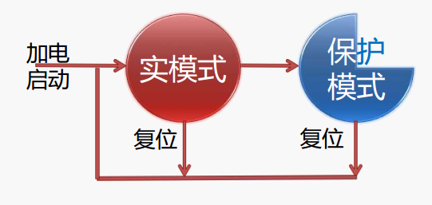
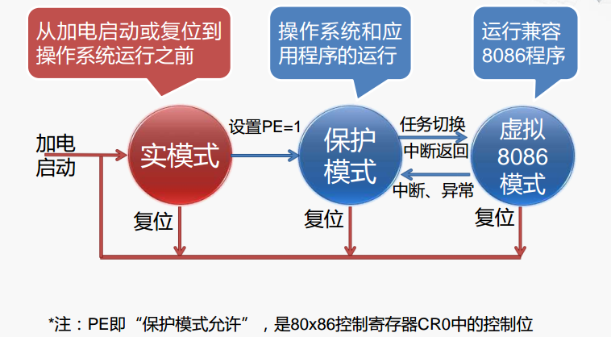
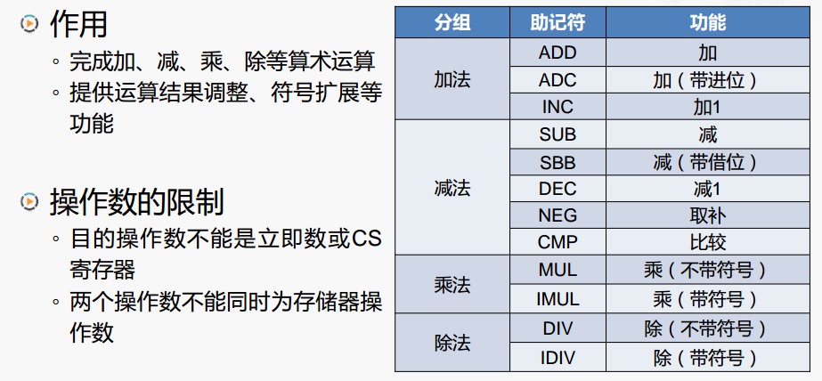
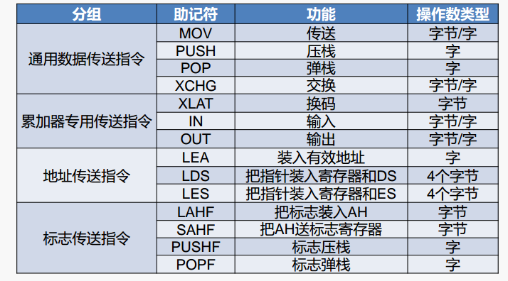
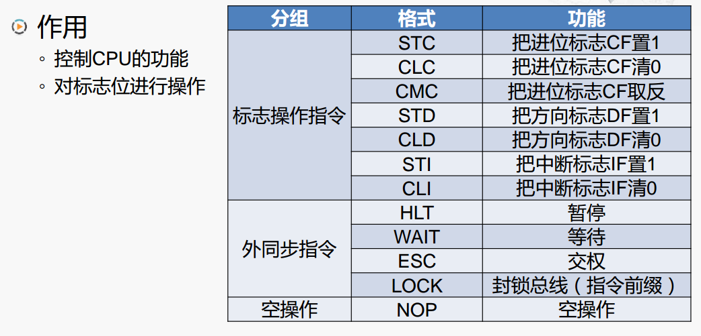
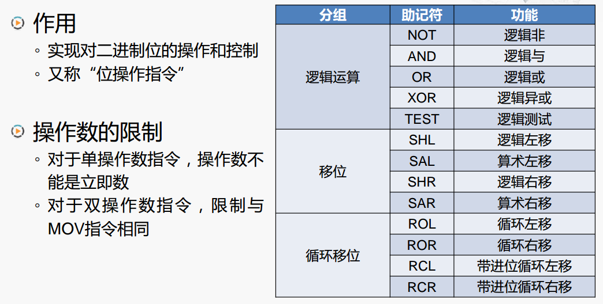

# x86

## Inter 8086（1978年）

1. 内部的通用寄存器为 16 位，表示既能处理 16 位数据，也能处理 8 位数据
2. 对外有 16 根数据线和 20 根地址线，可寻址的内存空间为 1MByte（2^20）
3. 物理地址的形成采用“ **段加偏移**” 的方式

### Intel 80286（1982年）

80286 的主要特点：

1. 地址总线扩展到 24 位，可寻址 16MB 的内存空间 ◦ 
2. 引入了“**保护模式**”，但是机制有缺陷，例如，每个段仍为 64KB，严重限制软件规模。为保持兼容，保留了 8086 的工作模式，被称为“ **实模式，**比如计算机通电之后 CPU 取出 BIOS 芯片中指令进行执行，这段程序就是在实模式下进行

### Intel 80386（1985年）

1. 80x86系列中的第一款32位微处理器
2. 支持32位的算术和逻辑运算，提供32位的通用寄存器 
3. 地址总线扩展到32位，可寻址4GB的内存空间
4. 改进了“ 保护模式” （例如，段范围可达4GB\)
5. 增加了“ 虚拟8086模式” ，可以同时模拟多个8086微处理器

### 实模式

实模式，又称“ 实地址模式”，系统初始化程序在实模式下运行， 为进入保护模式做好准备

### 保护模式

80386 及以上的微处理器的主要工作模式，**保护模式让操作系 统加强了对应用软 件的控制，使得系 统运行更安全高效**

* 支持多任务
* 支持设置特权级
* 支持特权指令的执行
* 支持访问权限检查
* 可以访问 4GB 的物理存储空间
* 引入了虚拟存储器的概念

### 虚拟 8086 模式

虚拟 8086 模式，又称“ V86模式” ◦ V86 模式实际上是保护模式下一种特殊工作状态

V86 模式与实模式 的比较：

* 相同点：可寻址的内存空间为1MB ， “ 段加偏移” 的寻址方式
* 不同点：对中断/异常的响应处理

### 三种工作模式之间的转换

## x86 基本指令

**运算类指令**：加、减、乘、除， 与、或、非等

**传送类指令**：从存储器到通用寄存器， 从通用寄存器到 I/O 接口等

**控制类指令**：暂停处理器、清除标志位等

**转移类指令**：无条件转移、条件转移、 过程调用等。比如 JMP

**逻辑运算和移位指令**

