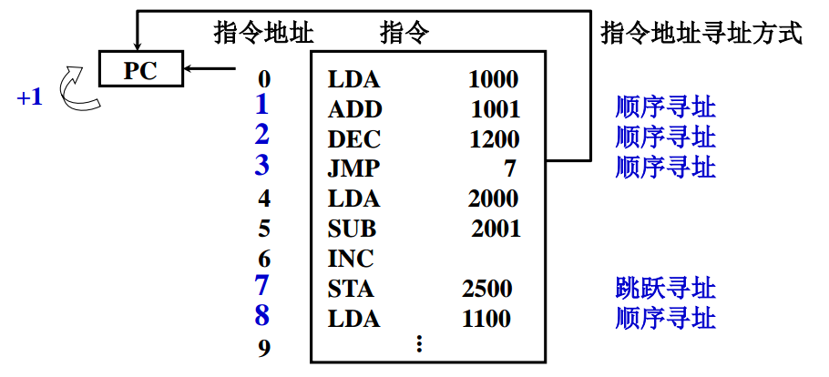
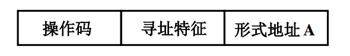
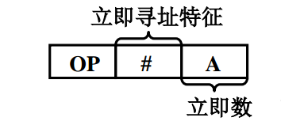
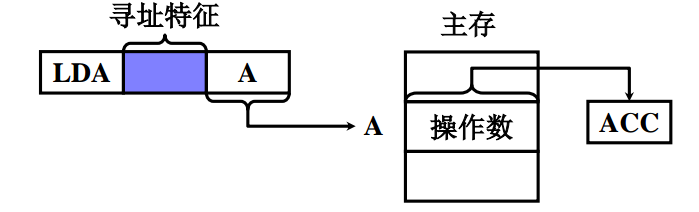
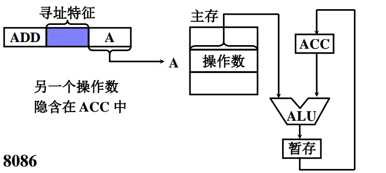
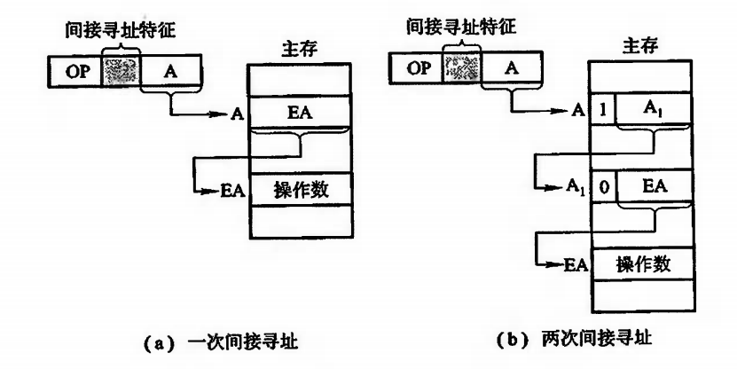
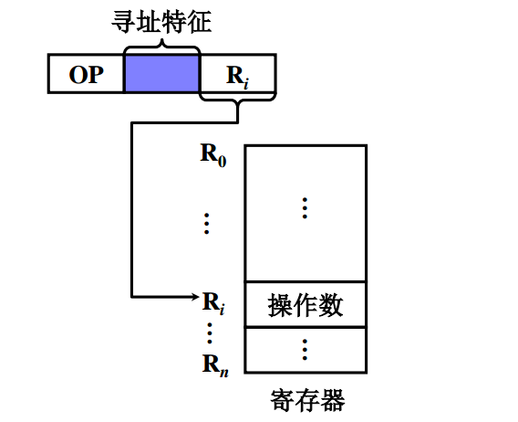
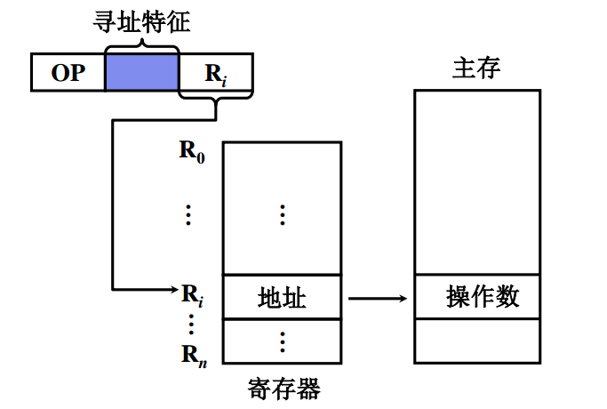

# 寻址方式

寻址方式是指确定本条指令的数据地址以及下一条将要执行的指令地址的方法。

寻址方式分为**指令寻址**和**数据寻址**

## **指令寻址**

* 顺序寻址：通过程序计数器 PC 加 1，自动新城下一条指令的地址
* 跳跃寻址：通过转移类指令实现

上图中程序首地址为 0 ，首先将 0 送至程序计数器 PC ，启动机器程序便按 0,1,2... 顺序执行，直到第 3 号地址指令 JMP 7 ，故执行完第 3 号指令后，将 7 送至 PC，此时指令地址跳过了 4,5,6，直接执行第 7 条指令，接着又顺序执行  8，9 指令

## 数据寻址

* 寻址特征：在指令字中必须设一字段指明属于哪一种寻址方式。
* 形式地址：指令字中的地址
* 有效地址：操作数的真实地址

### 立即寻址

形式地址 A 就是操作数，数据采用补码形式存放

### 直接寻址

指令字中的形式地址就是操作数的真实地址

### 隐含寻址

指令字中不明显给出操作数的地址。其操作数的地址隐含在操作码或某个寄存器中。

### 间接寻址

指令中的形式地址不直接指出操作数地址，而是指出操作数有效地址所在的存储单元地址。

### 寄存器寻址

地址码字段直接指出寄存器的编号，执行阶段不访存，只访问寄存器，执行速度快

### 寄存器间接寻址

有效地址在寄存器中， 操作数在存储器中，执行阶段访存

### 基址寻址

### 变址寻址

### 相对寻址

### 堆栈寻址

要求计算机设有堆栈，堆栈可以用寄存器组（称为硬堆栈）来实现，也可以利用主存一部分空间做堆栈（称为软堆栈）。

以软堆栈为例，可用堆栈指针 SP 指出栈顶地址，操作数只能从栈顶地址指示的存储单元存取

