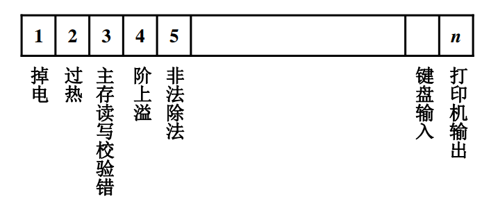
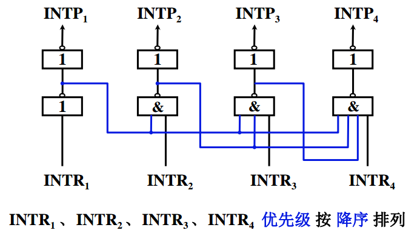

# 中断系统基本概述

采用中断技术实现主机与 I/O 交换信息，使得 **I/O 设备与 CPU 并行工作**，提高 CPU 效率。

计算机多道处理程序运行时，可以分配给每道程序一个固定时间片，利用时钟定时发中断进行程序切换，可见中断给计算机带来的巨大影响。

## 引发中断的因素

* 人为设置中断：比如用户程序执行**转管指令**，便中断当前程序，转入管理程序
* 程序性故障：比如除法非法
* 硬件故障：硬盘出现了坏道
* I/O 设备：输入输出
* 外部事件：使用键盘来中断现行程序

## 各中断源如何向 CPU 提出请求？

在中断系统中为每一个中断源设置一个**中断请求标记触发器**，记做 INTR，其状态为 1 时表示中断源请求，这种触发器可以集成在 CPU 内形成**中断请求标记寄存器**

## 各中断源同时提出请求怎么办 ？

任何一个中断系统，在任一时刻，只能响应一个中断源的请求，但存在多个中断源同时请求，可以按照一定顺序进行中断判优处理。

中断判优可以通过硬件和软件实现：

* 硬件排队
  * 链式排队器：分散在各个中断源的接口电路中，都设一个非门和一个与非门
  * 排队器在 CPU 内：按照优先级顺序1,2,3,4

* 软件排队：通过编写**查询程序**实现

## 如何寻找入口地址 ？

* 硬件向量法：利用硬件产生向量地址，再由向量地址找到中断服务程序的入口地址
* 软件查询法

## CPU 什么条件、什么时间、 以什么方式响应中断 ？

**条件**：允许中断触发器 EINT = 1

**时间**：指令执行周期结束时刻由 CPU 发查询信号

**响应：中断隐指令，**CPU ****响应中断，要去执行**中断服务程序**，为将来的中断返回做准备

* 保护程序断点 ：将程序计数器 PC 的内容保存到存储器，可以存于**特定地址**（0 号地址） 内，也可以**存入堆栈**。
* 寻找服务程序入口地址：硬件向量法，软件查询法
* **关中断：**CPU 响应了某个中断源的请求，为了确保不收其他中断请求干扰，在中断周期需要自动关闭中断，即把**中断触发器 EINT = 0**

## 如何保护现场和恢复现场 ？

保护现场包括：

* **保护程序断点：**由中断隐指令完成
* **保护 CPU 内部个寄存器内容的现场：**由用户或系统用机器指令变成完成

恢复现场：由**中断服务程序**完成

## 处理中断的过程中又出现新的中断怎么办 ？

当 CPU 正在执行某个中断服务程序时，另一个中断源又提出了新的中断请求，且当前中断源优先级更高高，则中断服务程序的执行会再一次被中断，CPU 回去响应新的中断服务请求。这就是**多重中断**

**实现多重中断条件**

* 提前设置**开中断**指令
* 优先级别高的中断源有权中断优先级别低 的中断源

