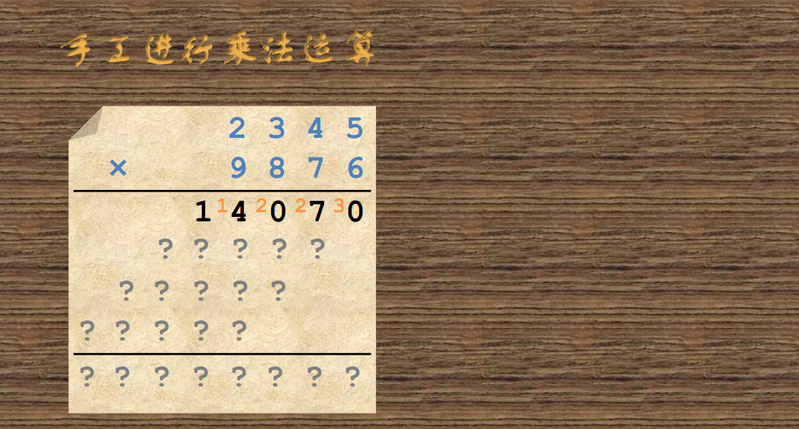
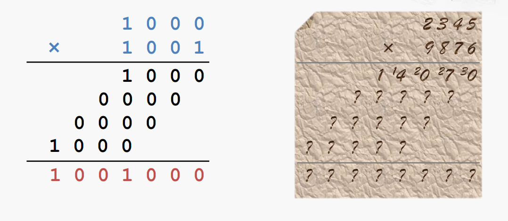
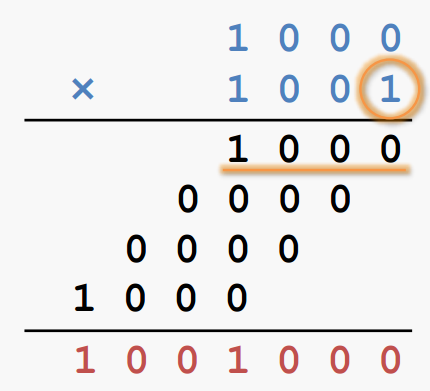
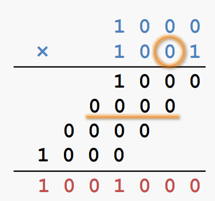
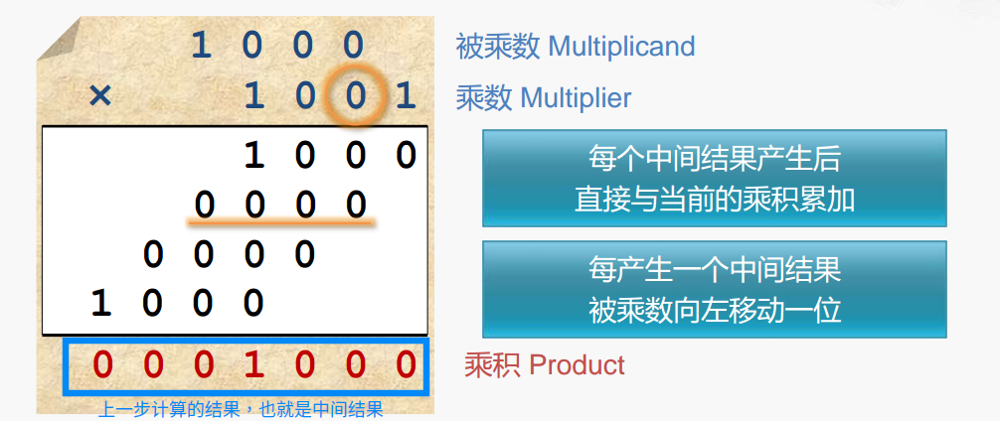
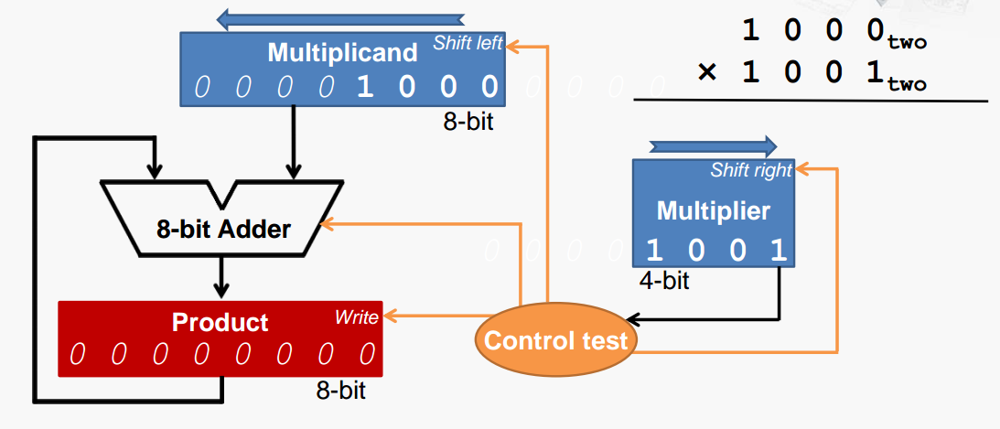
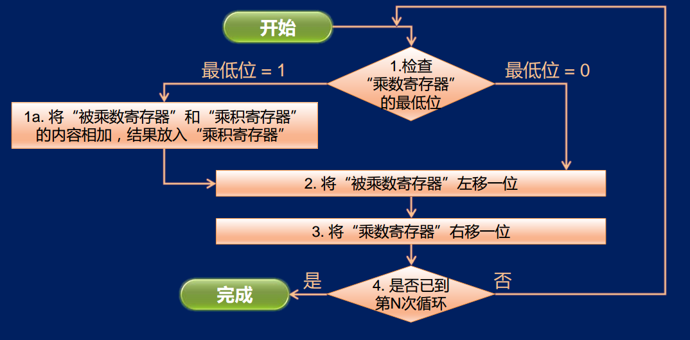
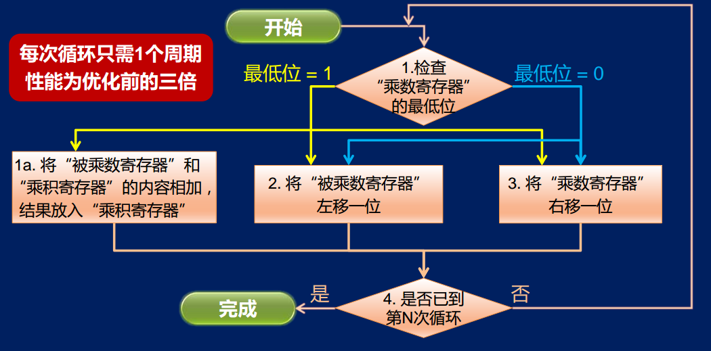
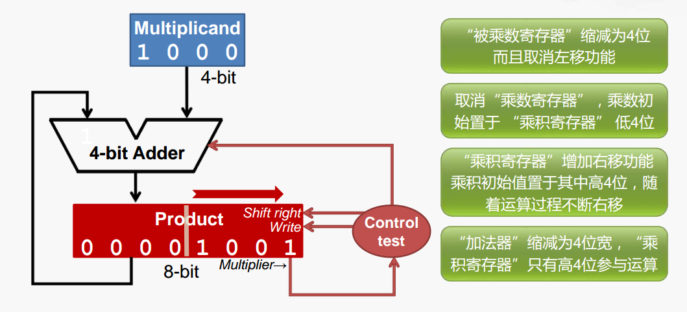
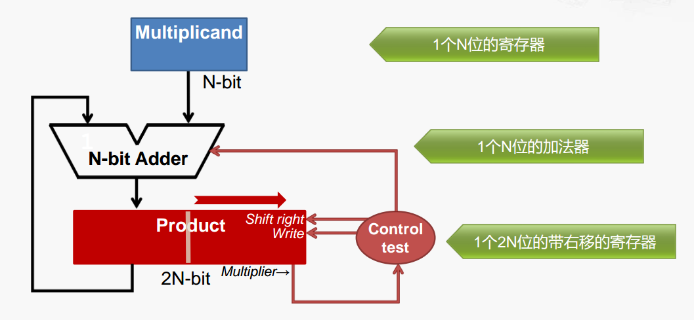

# 乘法器和除法器

## 乘法运算过程

通过我们手工运算知道，乘法运算就是被乘数和乘数每一位相乘，最后把所得的乘积相加即可。

不过需要注意乘法运算有个重要部分就是**进位**

但是在计算机中只存在 0 和 1 ，这样我们通过一个只包含 0 和 1 的乘法运算，进一步来查看这个过程。

细心点可以发现，**如果当前参与运算的乘数位为1， 则直接将被乘数放置在对应位置上，如果当前参与运算的乘数位为0， 则直接将“ 0”放置在对应位置上**

\*\*\*\* **** 

通过上述运算，我们看似是 1000 \* 1001 的十进制乘法运算，实际它已经完成了计算机二进制乘法运算的要求。因为运算过程只包含了 0 和 1 ，所以对于计算机的乘法运算就可以利用上述的办法进行运算。

但是在真正计算机实现中还需要解决两个问题：

* 中间结果怎么处理
* 乘法运算每次都要移位怎么处理

通过上图可以得知，每个中间结果产生后直接与当前的乘积累加，默认初始乘积为 0000000，由此解决了中间结果问题，其次每产生一个中间结果被乘数向左移动一位，从而解决了乘法运算每次都要移位

### **乘法器的实现**

* Multiplicand ：8 位 被乘数寄存器
* Product ：8 位 乘积寄存器
* 8-bit Adder：8 位加法器
* Multiplier：4 位 乘数寄存器，且乘数寄存器最低位连接到控制逻辑
* Control test：控制逻辑，控制信号：是否让加法器加法运算，是否让乘积寄存器保存当前运算结果，是否让被乘数左移，是否让称数右移

工作过程：

1. 初始化，被乘数，乘数，乘积三个寄存器
2. 检查乘数寄存器内容是否为 1 ，如果为 1 则把被乘数寄存器内容和乘积寄存器内容相加并把结果写回乘积寄存器，否则为 0 不做任何操作
3. 被乘数左移，乘数寄存器右移
4. 还需要一个计数功能，判断乘法运算需要运行几次，上图的例子只需要 4 次，当达到 4 次运算就结束

### N位乘法器的工作流程图

### 乘法器的优化

**加法移位并行**

每次进行加法操作需要一个时钟周期，每次被乘数移位有需要一个时钟周期，同理乘数移位也需要一个时钟周期。为此我们可以将这三步并行起来，在一个时钟周期同时完成

**减少不必要的硬件资源**

### N位乘法器的实现结构

## 除法运算过程


比较复杂，留一个坑 😂 


