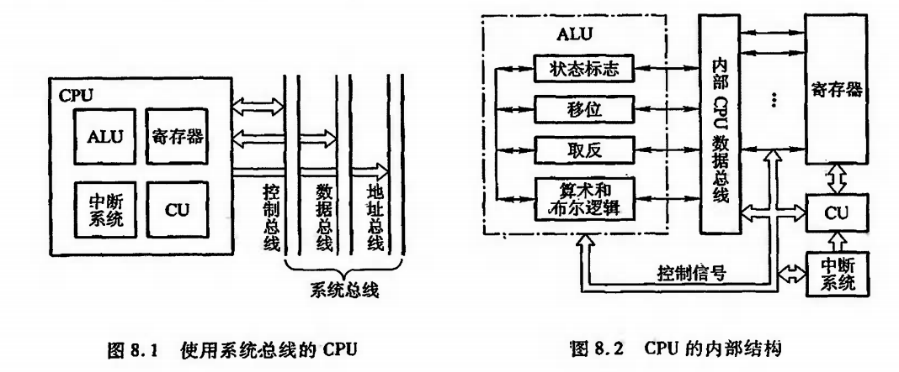

# CPU 的结构和功能

## CPU 功能

### 控制器的功能

控制器负责协调并控制计算机各部件执行程序的指令序列，基本功能有：

* 取指令：自动从存储器取出指令
* 分析指令：分析指令完成什么操作，参与本次操作的操作数有效地址
* 执行指令：根据分析指令的结果形成操作控制信号。通过运算器、存储器、I/O 设备的操作，执行每条指令
* 指令控制：控制程序的顺序执行。
* 操作控制：产生完成每条指令所需的命令
* 时间控制：对操作加以时间上的控制
* 数据加工：对数据进行算术运算和逻辑运算以及处理中断

## CPU 结构

* 寄存器：存放当前指令地址和数据
* CU：发送在各种操作命令序列的控制部件
* ALU：完成算术运算和逻辑运算
* 中断系统：处理异常情况和特殊请求
* 程序计数器：用来存储下一条指令的地址，循环从程序技术器拿出指令
* 时序发生器：发送时序脉冲，CPU 依据不同的时序脉冲有节奏的运算工作
* 指令译码器：翻译操作码对应的操作以及控制传输地址地址码对应的数据

### CPU 的寄存器

* **通用寄存器**：用于暂时存放或传送数据或指令，保存 ALU 运算中间结果
* **数据寄存器：**保存当前 CPU 正要读或写的主存数据，通过数据总线与主存相连
* **地址寄存器：**保存当前 CPU 正要访问的内存单元地址，通过地址总线与主存相连
* **条件码寄存器**：CPU 根据运算结果由硬件设置的位，例如，是否产生正、负、溢出
* **控制和状态寄存器**：
  * MAR：存储器地址寄存器，用于存放将被访问的存储单元地址
  * MDR：存储器数据寄存器，用于存放将要存入存储器中的数据
  * PC：程序计数器，存放现行指令地址
  * IR：指令寄存器，存放当前欲执行的指令

### 控制单元和中断系统

控制单元是提供完成计算机全部指令操作的微操作命令序列部件。现代计算机中的微操作命令序列有两种：

* 组合逻辑设计方法，硬连接逻辑
* 微程序设计方法，存储逻辑

