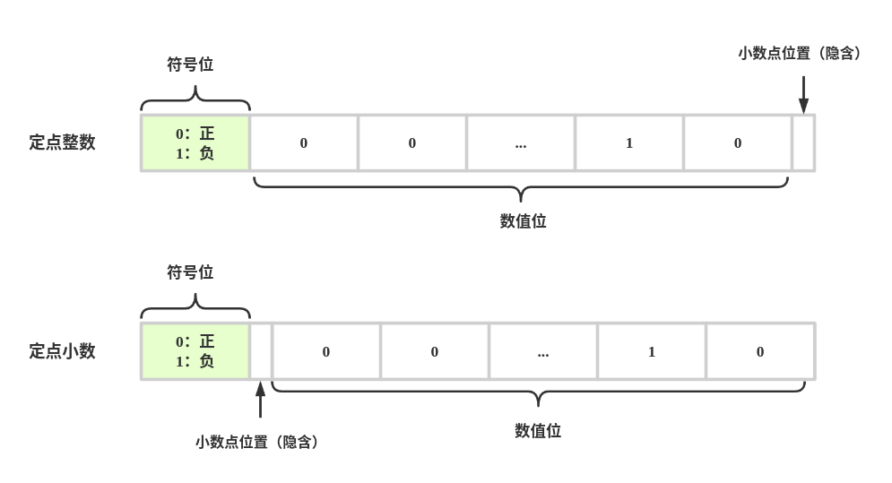
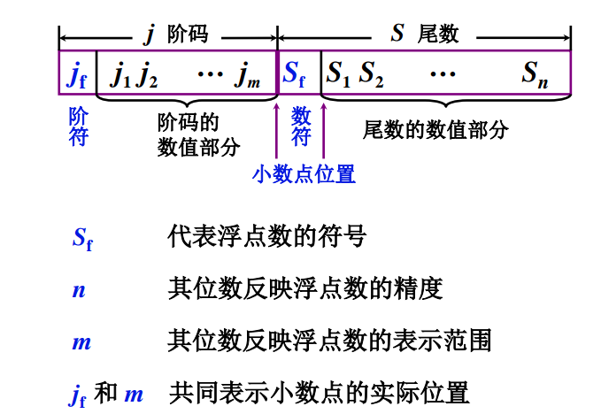

# 定点和浮点

## 定点表示


定点数表示所有数据中的小数点位置固定不变


* 对于有 n 位的二进制可表示**原码定点整数**范围： $$-(2^{n}-1)～2^{n}-1$$ 
* 对于有 n 位的二进制可表示**原码定点小数**范围： $$-(1-2^{-n})～(1-2^{-n})$$ 

## 浮点表示

由于某些数值范围相差很大，比例电子的质量 $$9*10^{-28}g$$ ，太阳的质量 $$2*10^{33}g$$ ，他们都不能直接用定点小数或者定点整数表示，但是均可以使用浮点数表示。

**所谓浮点数就是小数点可以浮动的数**，比如：

$$352.47$$ = $$3.5247*10^{2}$$ = $$3524.7*10^{-1}$$ = $$0.35247*10^{3}$$ 

### 浮点数的表示形式

比如 $$+3.5247*10^{+2}$$ :

* 其中 +2 表示**阶码，**其中 + 表示**阶符**，2 表示**阶码数值**。如果阶负正表示小数点往后，否则为负，小数点往前移，而阶码数值指明了需要移动多少位
* +3.5247表示**尾数，+ 表示数符**代表整个数值的正负性，3.5247 表示尾数数值部分，数值部分越短，精度越低

**浮点数的表示**

$$
N=S*r^{j}
$$

**S 为尾数（可正可负），j 为阶码（可正可负），r 是基数，在计算机中，基数可取 2、4、8、16等**

