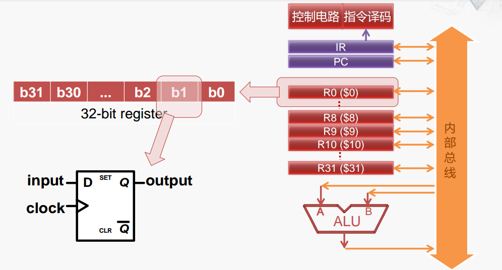
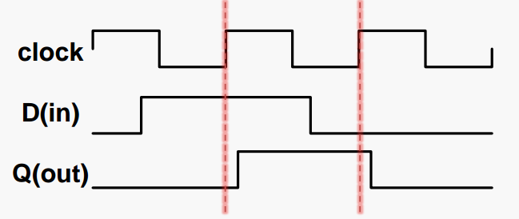

# 寄存器的基本原理

## 寄存器的内部结构

上图是一个 32 位的寄存器，寄存器的每一位都是一个 **D触发器**

**D触发器**：

* 具有存储信息能力的基本单元
* 由若干逻辑门构成，有多种实现方式
* 主要有一个数据输入、 一个数据输出和一个时钟输入
* 在时钟 clock 的上升沿（0→1），采样输入 D 的值，传送到输出Q，其余时间输出 Q 的值不变。如下图进行解释：

比如从左到右， D 最先发生了变化，但是由于时钟上升沿没有到来，Q 并未发生变化，直到第一条红线时，时钟上升沿到来，采样输入 D 的值，传送到输出 Q，此时 D 是 1，所以 Q 是 1。

接着在上时钟周期内，D 由 1 变成了 0，但是时钟上升沿没有到来，所以 Q 不会发生变化，直到第二条红线，时钟上升沿到来，采样输入 D 的值，传送到输出 Q，此时 D 是 0 ，所以 Q 由之前 1 变成 0

