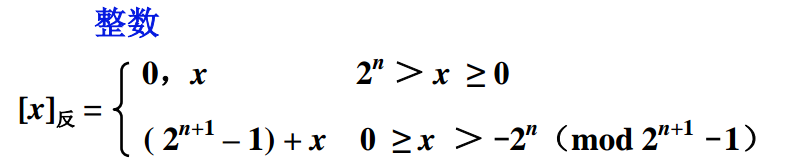

# 计算机的计算方法

## 无符号数

计算机中的数均放在寄存器中，通常称寄存器的位数为**机器字长。**所谓无符号数就是没有符号，在寄存器中的每一位均可用来存放数值。

下面是 8 位二进制和 16 位二进制无符号数范围：

## 有符号数

有符号数顾名思义就是带有符号的数，通常我们把带有 `+` 或者 `-` 符号的数称为**真值**

但是在计算机中，对于正负号机器无法识别，就需要把正负号数字化，一般用 0 表示正，1 表示负，并且规定把它们放在有效数字前面，这种数字化的数称为**机器数**

例如下面几种表示方法：

## **原码表示法**

* **整数原码定义**

式中，x 为真值 n 为整数的位数

例如：

当 x = + 1110 时，\[x\]原 = 0,1110

当 x= - 1110 时，\[x\] 原 = 2^4 - \( - 1110 \) = 1,1110

* **小数原码定义**

例如：

当 x = + 0.1101 时，\[x\]原 = 0.1101 。用**小数点**将符号位和数值部分隔开

当 x = - 0.1101 时，\[x\]原 = 1 - \( - 0.1101 \) = 1.1101 。用**小数点**将符号位和数值部分隔开

当 x=0 时，

* \[+ 0.0000\]原 = 0.0000
* \[- 0.0000\]原 = 1.0000
* \[+ 0\]原 = 0,0000
* \[- 0\]原 = 1,0000


使用原码简单、直观，但是用原码作加法时会出现加法运算也会出现减法运算，对于减法运算器的设计相对麻烦。能否只作加法？


## 补码表示法

补的概念，比如生活中的时钟，假设时钟指示 6 点，我想让它指示 3 点，有两种办法，一种是逆时针方向时针转 3 个小时，就相当于减法操作 6-3 = 3。另外一张就是顺时针时针转 9 个小时，就相当于加法操作 6 + 9 = 15，由于 12 点开始又重新计算，即 15 - 12 = 3。

类似时钟以 12 为模的设备，可以用 +9 代替 -3 ，用加法代替减法，称 + 9 是 3 以 12 为模的**补数**，记作 3 ≡ + 9 （ mod 12）

结论：

* 一个负数加上**模**即得该负数的补数 
* 一个正数和一个负数互为补数时 它们绝对值之和即为**模数**
* 正数的补数即该正数本身

将补数的概念用到计算机，便出现了补码这种机器数

例如：

当 x = +1010 时，\[x\]补 = 0,1010。 用**逗号**将符号位和数值部分隔开

当 x = - 1011000 时，\[x\]补 = 2^\(7+1\) +\( 1011000 \) = 100000000 - 1011000 = 1,0101000

例如：

当 x = + 0.1001 时，\[x\]补 = 0.1001 用**小数点**将符号位和数值部分隔开

当 x = - 0.1100000 时，\[x\]补 = 2 + \( 0.1100000 \) = 10.0000000 - 0.1100000 = 1.0100000

## 反码表示法


对于**正数**， **原码 = 补码 = 反码**。对于**负数** ， 符号位为 1， 其数值部分原码除符号位外每位取反末位加 1 得到**补码**，原码除符号位外每位取反得到**反码**


## 移码表示法

移码是在补码的基础上将符号为取反，但是需要注意**移码只能表示整数不能表示小数**


在计算机的中所有参与运算的数值都是以**补码**的形式参与运算，其原因是补码可以弥补反码无法计算有符号数，同时可以处理原码和反码对零的表示有两种方法。

而对于移码可以**有效解决补码很难直接判断其真值大小**


