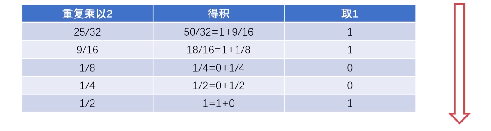

# 进制运算与转换

## 进制的表示方法

### 十进制计数法

对于十进制 975 可以表示为： $$9*100+7*10+5*1$$ ，转换为次方可表示为： $$9*10^{2}+7*10^{1}+5*10^{0}$$ 

所以可以的到十进制表示方法：

$$
K_{n}K_{n-1}...K_{0}=K_{n}*10^{n}+K_{n-1}*10^{n-1}+...+K_{2}*10^{2}+K_{1}*10^{1}+K_{0}*10^{0}
$$

### 二进制计数法

同十进制一样，对于一个二进制数 **0b101.1** 可以表示为： $$1*2^{2}+0*2^{1}+1*2^{0}+0*2^{-1}$$ 

所以二进制表示方法为：

$$
K_{n}K_{n-1}...K_{0}=K_{n}*2^{n}+K_{n-1}*2^{n-1}+...+K_{2}*2^{2}+K_{1}*2^{1}+K_{0}*2^{0}
$$

### 八进制计数法

对于 **0o5.4** 采用八进制表示可得： $$5*8^{0}+4*8^{-1}$$ 

所以八进制表示方法为：

$$
K_{n}K_{n-1}...K_{0}=K_{n}*8^{n}+K_{n-1}*8^{n-1}+...+K_{2}*8^{2}+K_{1}*8^{1}+K_{0}*8^{0}
$$

### 十六进制表示法

由于 1 位只能表示一个数，所以对于 1-15 采用 1,2,3,4,5,6,7,8,9,A,B,C,D,E,F 的方式进行表示。

对于 **0xAE86.1** 采用 16 进制表示可得： $$10*16^{3}+14*16^{2}+8*16^{1}+6*16^{0}+1*16^{-1}$$ 

所以十六进制表示方法是：

$$
K_{n}K_{n-1}...K_{0}=K_{n}*16^{n}+K_{n-1}*16^{n-1}+...+K_{2}*16^{2}+K_{1}*16^{1}+K_{0}*16^{0}
$$

## 进制的转换

### 二进制转十进制（整数）

假设 N = 1024，则十进制计算方式为：

$$
N = 1*10^{3}+0*10^{2}+2*10^{1}+4*10^{0}
$$

所以对于二进制 N = 0b1000000000，计算成十进制：

$$
N = 1*2^{10}+0*2^{9}+...+0*2^{1}+0*2^{0}
$$

### 二进制转十进制（小数）

假设小数二进制 N = 0.11001，计算：

$$
N = 1*2^{-1}+1*2^{-2}+0*2^{-3}+0*2^{-4}+1*2^{-5}
$$

### 二进制转八进制

三位一组，每组转换成对应的八进制符号，例如 0b1111000010.01101 转换成八进制

$$
001/111/000/010/./011/010  = 1702.32
$$

### 二进制转十六进制

四位一组，每组转换成对应的十六进制符号，例如上面的二进制数，转换十六进制

$$
0011/1100/0010/./0110/1000 = 3C2.68
$$


同理对于八进制转换成二进制，只需要把八进制的每一位对应二进制的 3 位，而对于十六进制转换为二进制，只需要把十六进制的每一位对应成二进制的 4 位


### 十进制转二进制（整数）

* **重复相除法**

使用十进制数重复除以 2，直到商为 0，所得到的所有余数倒叙排列就是二进制表示法

### 十进制转二进制（小数）

* **重复相乘法**

十进制小数不断的乘以2，取出个位数，在用剩余的小数继续乘以2，直到乘积结果刚好为 1，把所得到的个位数一次排列就是二进制的小数点后面的数

