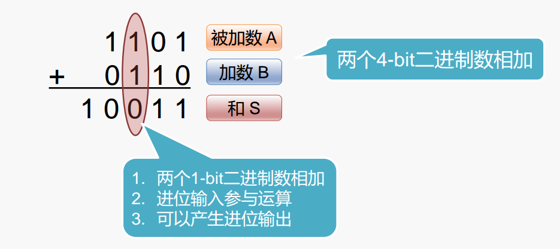
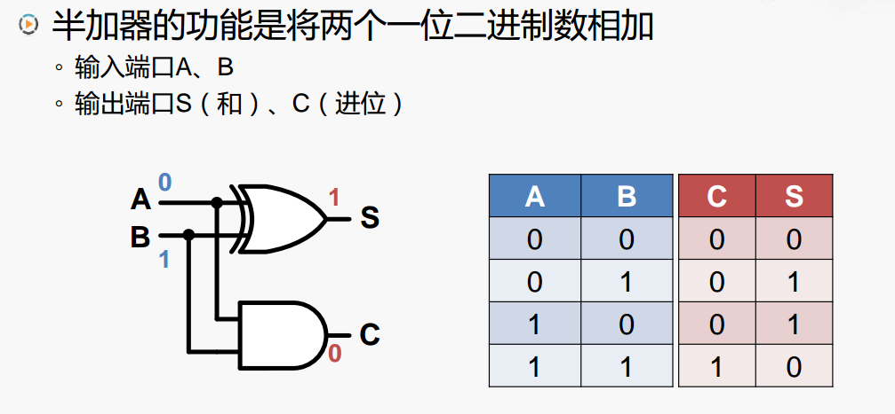
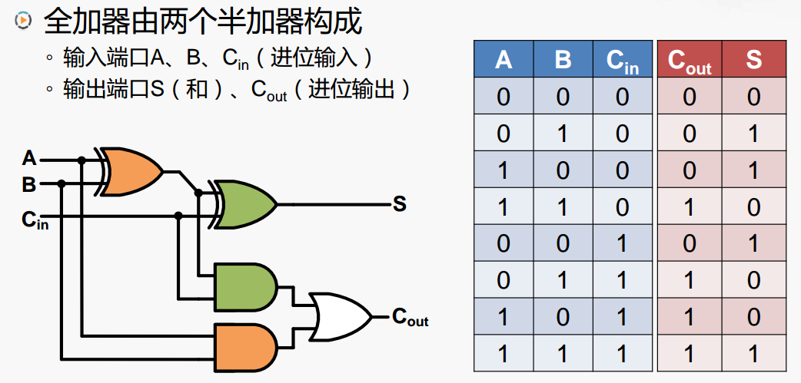
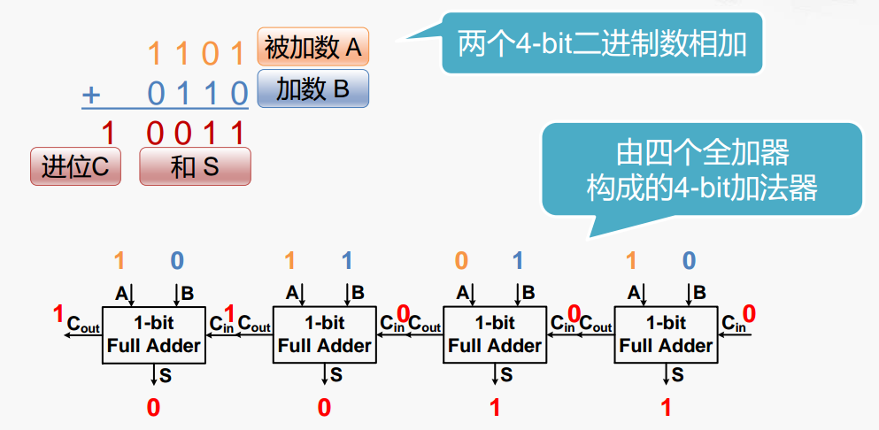
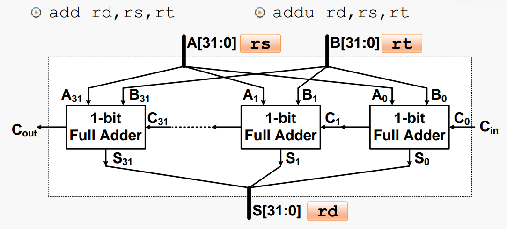
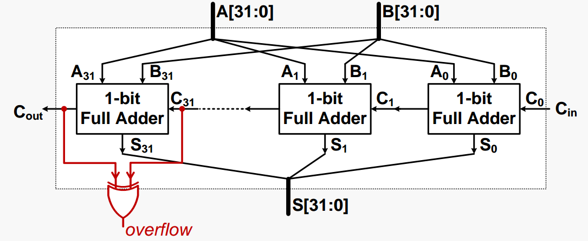
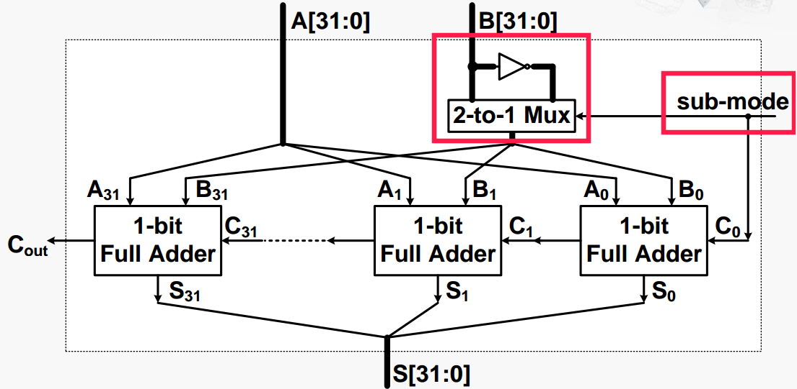

# 加法和减法的实现

## 加法运算

对于两个二进制数的加法运算，只需要从低位开始每一位相加，并且需要符合逢二进一。

### 半加器

下面是通过**半加器**实现两个二进制数的相加

其中 A 和 B 是两个输入端口，产生的和输出在 C ，如果 A B 的和出现了进位，则把进位输出到 C，即有进位就是 1 ，没有进位就是 0。

比如 A = 0，B = 1，经过异或门输出，得到结果为 1，即 S 为 1。而对于下面的与门输出结果为 0 ，所以 C 为 0。正好符合两个二进制数相加的和。

但是半加器有一个问题就是没法把当前的进位作为下一次的输入，为了解决这个问题，就有了下面的**全加器**

### 全加器

全加器就是把当前的进位保存在 $$C_{out}$$ ，在下一次运算时，作为输入传递给 $$C_{in}$$ 。

了解了全加器，下面就可以构成一个 4-bit 的加法器。

### 加法器

上面是一个 4-bit 的加法器。其通过把 4 个全加器串连在一起，这样前一个全加器的进位输出，就可以作为当前加器的进位输入。

其工作原理，就是每个输入参数的每一位对应一个全加器的一位输入，4 位的加法运算，对应 4 个全加器。

同理对于 32 位的全加器只需要使用 32 个全加器串连，如下图所示。

有了加法器，我们还需要解决一个问题，由于计算机是按照固定位数进行存储。在运算的过程中可能出现运算结果超过正常范围，也被称为**溢出**


**对于溢出而言，仅针对有符号数**


对于溢出的检查，只需要**最高位的进位输入” 不等于“ 最高位的进位输出**即可。通过添加一个异或门即可判断。

当最高位的进位输入**等于**最高位的进位输出，通过异或门，输出为 0 ，当最高位的进位输入**不等于**最高位的进位输出，通过异或门，输出为 1。

比如一个二进制数 0011（+3） 与 0101（+5） 相加，最终结果为 **0**1000（-8），出现了溢出，且在运算过程中最高位的进位输入 1 **不等于**最高位的进位输出 0 。

所以通过异或门的结果就可以判断运算是否出现了溢出，为 1 则表示溢出，为 0 表示没有溢出。

## 减法运算

在计算机中由于减法器的电路设计特别复杂，通常把减法运算转换成加法运算： $$A-B=A+(-B)$$ 

在计算机中是在用补码来表示二进制数，所以**补码表示的二进制数的相反数，通过按位取反，末位加一的转换规则**，所以在加法器的基础上实现减法器： $$A + (-B)= A + (～B+1)$$ 

所以通过对加法器进行改造，如下图。

增加一了一个新的输入，sub-mode 只有一个 bit ，称为减法模式。它控制一个一个二选一的多选器。

如果信号为 0 表示执行加法操作，输入结果不做改变，同时它还连接着一个最低位的进位输入也为 0。

如果信号为 1 表示执行减法操作，输入结果通过非门，结果取反，传输到全加器，同时它还连接着一个最低位的进位输入也为 1。刚好对应着**按位取反，末位加一转换规则，**从而实现减法运算转换为加法运算。

## 加法器的优化

通过上面的加法器，我们可以知道，其结构特点是串连全加器来完成，低位全加器的 $$C_{out}$$ 连接到高一位全加器 $$C_{in}$$ 。这种加法器特点是电路布局简单，设计方便，但是高位的运算必须等待低位的运算完成，延迟时间长。这种加法器也被称为**行波进位加法器（Ripple-Carry Adder，RCA）**

**加法器的优化思路**

主要问题 **：**

* 高位的运算必须等待低位的进位输出信号

优化思路：

* 能否提前计算出“ 进位输出信号” ？

存在一个加法器，**超前进位加法器（Carry-Lookahead Adder，CLA），**有兴趣可以了解

