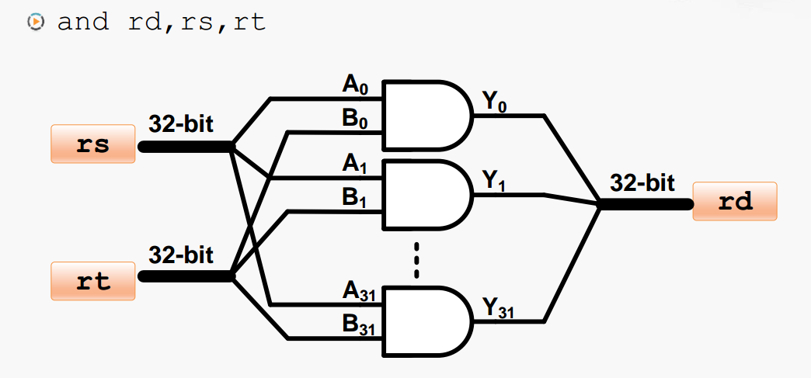

# 逻辑运算的实现

上图中是一个与门，通过对两个二进制位进行与操作就可以输出结果。但是在计算机中必然不可能只算一位二进制，比如：\`add rd,rs,rt\`，就是需要同时对两个 32 位的二进制数进行与操作，并得到一个 32 位的运算结果。

为了解决这个问题，可以利用如下图所示的方法。

通过把 32 个与门并排连接在一起，对于 32 位输入每一位连接一个与门，比如 rs 分别连接 A0-A31 作为第一个操作数，rt 输入分别连接 B0-B1 作为第二个操作数。32 个与门的输出即为 Y0-Y31保存到 rd 寄存器。

同理对于或运算，如下图所示。

通过把32 个或门并排连接在一起，对于 32 位输入每一位连接一个或门。

