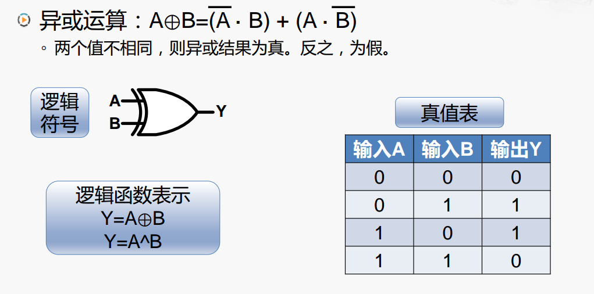

# 门电路的基本原理

## 晶体管

现代集成电路中通常使用 MOS（Metal-Oxide-Semiconductor：金属-氧化物-半导体） 晶体管。

MOS 晶体管主要分为两种类型：

NMOS 有三个连接，如果 Gate 连接了高电平，表示晶体管导通，电流从 Source 流向 Drain，如果 Gate 连接了低电平，晶体管是不导通的

PMOS 与 NMOS 刚好相反，如果 Gate 连接了低电平，表示晶体管导通，电流从 Source 流向 Drain，如果 Gate 连接了高电平，晶体管是不导通的

## 晶体管构建逻辑门

### 非门

### 非门的工作过程

## 与门

## 或门

## 异或门

