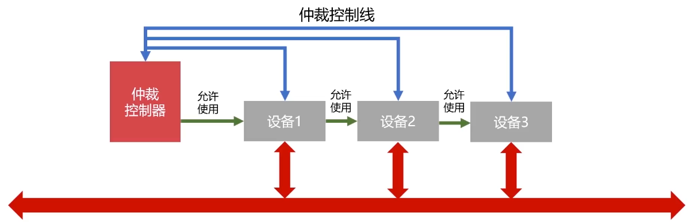
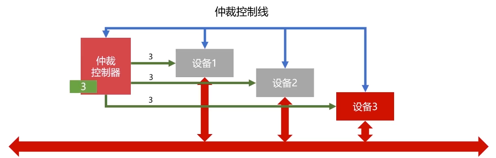
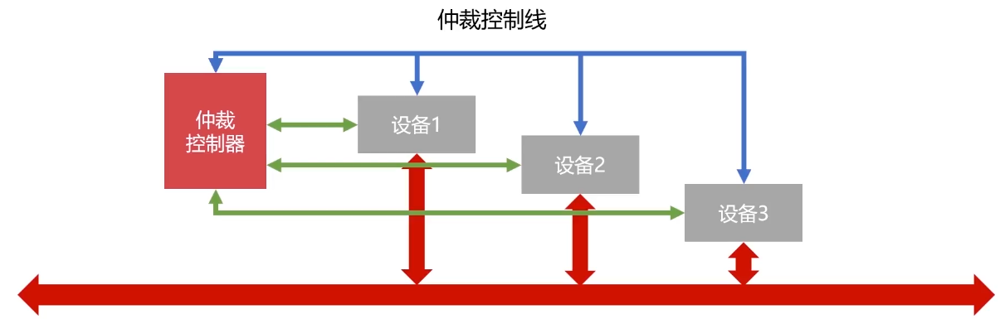

# 总线控制

## 总线控制

当总线连接多个部件，什么时候由那个部件发送信息，如何给信息传送定时，如何防止信息丢失，如何避免多个部件同时发送等等问题都需要由**总线控制器**统一管理。它主要包括**判优控制**和**通信控制**

## **判优控制**

### 链式查询

假设设备 ****2 需要使用总线，设备 2 就通过仲裁控制线给仲裁控制器发送信号，仲裁控制器就会返回允许使用信号，但是信号会先经过设备1，在到设备 2。如果存在设备 1 和设备 2 都发送了请求使用总线的信号，则最终设备 1 会优先使用。

特点：

* 只需要很少几根线就能按一定优先次序实现总线控制
* 扩展设备容易
* 优先级底的设备难以获得请求
* 对电路故障敏感

### 计数器定时查询

仲裁控制器分别与设备连接，并且仲裁控制器有一个计数器，假设此时设备 3 需要使用总线，则设备 3 会通过仲裁控制线向仲裁控制器发送请求，仲裁控制器计数器从 0 开始计数，并通过设备地址线向所有设备发送地址信号，当某个请求占用总线的设备地址与计数值一直时，便获得总线控制权，此时停止计数查询，否则计数值增加继续发送

### 独立请求

* 每个设备均有总线独立连接仲裁器
* 设备可以单独向仲裁器发送和接受请求
* 同时收到多个信号，仲裁器按照优先级分配使用权
* 响应速度快、优先次序控制灵活、但控制总线数量多、总线控制复杂

