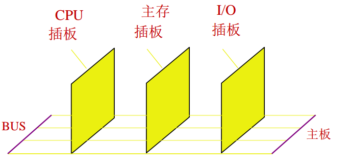

# 总线基本概念

## 什么是总线

总线用于连接多个部件进行信息传输，由于多个部件连接总线，所以在某一时刻只允许一个部件向总线发送信息，其他部件都可以同时收到。如果存在几个部件一起发这会导致信号冲突。

总线是由许多**传输线或通路**组成，每条线可一位一位的传输二进制代码，同样多条传输线可并行传输。例如 16 条传输线组成的总线可同时传输 16 为二进制代码。

## 总线的物理实现

从物理角度，总线由许多导线直接印刷在电路板上，延伸到各个部件。

## 总线特性

### 机械特性

指总线在机械连接方式的一些性能，如插头与插座的标准，形状、尺寸、引脚的个数与排列，接头处的可靠传输

### 电气特性

指总线的每一根传输线上信号的**传递方向**和有效的**电平**范围。例如：地址总线属于单向输出线，数据总线属于双向传输线，他们都定义高电平为 1，低电平为 0，控制总线的每一根都是单向的。

### 功能特性

指总线中每根传输线的功能，例如：地址总线用来指出地址码，数据总线用来传递数据，控制总线发出控制信号

### 时间特性

是指总线中的任一根线在什么时间有效

## 总线性能指标

* **总线宽度**：**数据总线**的根数，用 bit 表示，如 8位、16位、32位、64位（即 8 根、16根、32根、64根）
* **总线带宽**：总线传输速率，单位时间内总线传输数据的位数，通常用每秒传输信息的字节数衡量，单位可用 MBps（兆字节每秒），例如，总线工作频率 33 MHz，总线宽度为 32 位，则总线带宽 33 \* （32 / 8）= 132 MBps。
* **时钟同步/异步**：总线上的数据与时钟同步工作的总线称为同步总线，不同步的称为异步总线
* **总线复用**：一条信号线不同时间传输两种信号
* **信号线数**：地址总线、数据总线、控制总线三种总线数和
* **总线控制方式**：突发工作、自动配置、仲裁方式、逻辑方式、计数方式
* 负载能力
* 总线宽度是否可扩展

