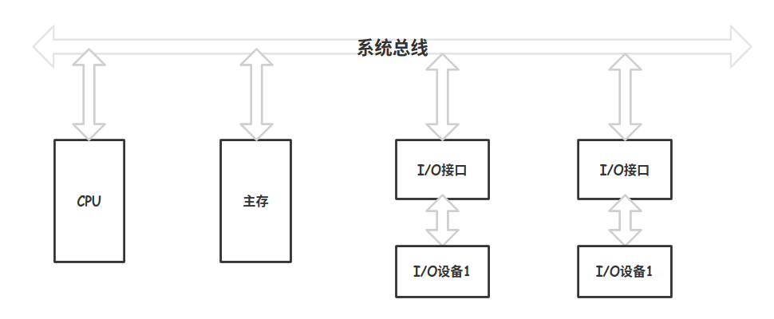
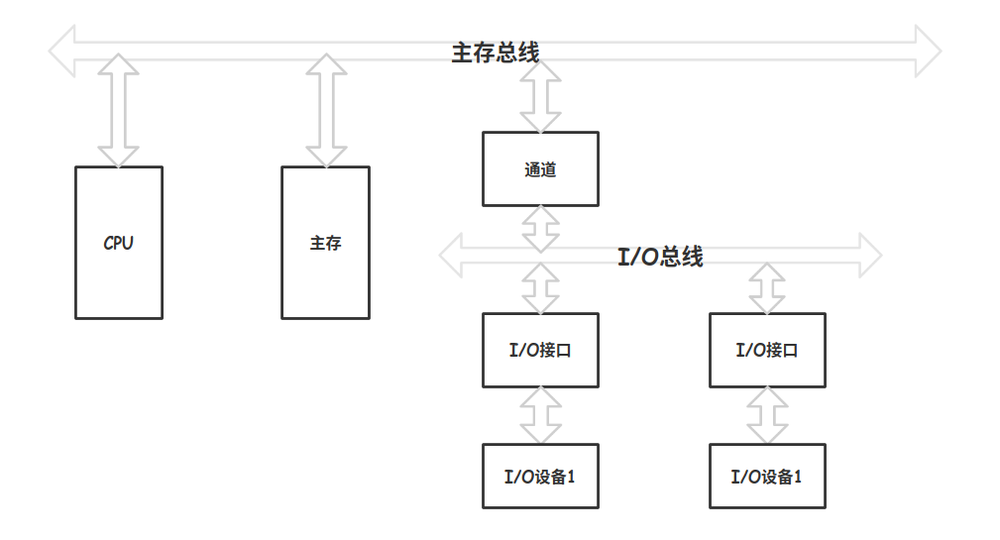
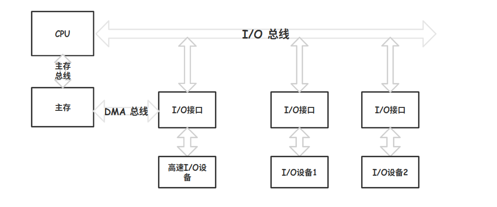

# 总线结构

## 单总线结构

CPU 、主存、I/O 设备都挂在一组总线上，允许之间相互直接交换信息，结构简单，但是容易出现瓶颈

## 双总线结构

一条主存总线，用于 CPU 、主存和通道之间进行数据传送，另一条 I/O 总线用于多个外部设备与通道之间进行数据传送

通道是一个具有特殊功能的处理器，CPU 将一部分功能下放给通道，使其对 I/O 设备具有同一管理的功能，完成外部设备与主存储器之间数据传送

## 三总线结构

主存总线用于 CPU 与主存之间的传输，I/O 总线供 CPU 与各类 I/O 设备之间传递信息。DMA 总线用于高速 I/O 设备与主存之间直接交换信息。

**在三总线结构中，任一时刻只能使用一种总线，主存总线与 DMA 总线不能同时对主存进行存取，I/O 总线只有在 CPU 执行 I/O 指令时才能用到。**

