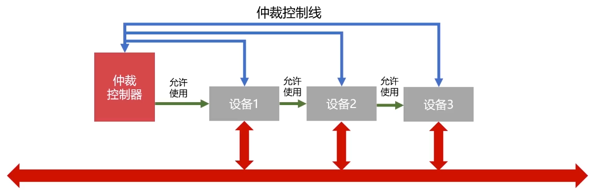

# 总线控制

## 总线控制

当总线连接多个部件，什么时候由那个部件发送信息，如何给信息传送定时，如何防止信息丢失，如何避免多个部件同时发送等等问题都需要由**总线控制器**统一管理。它主要包括**判优控制**和**通信控制**

## **判优控制**

### 链式查询

假设设备 ****2 需要使用总线，设备 2 就通过仲裁控制线给仲裁控制器发送信号，仲裁控制器就会返回允许使用信号，但是信号会先经过设备1，在到设备 2。如果存在设备 1 和设备 2 都发送了请求使用总线的信号，则最终设备 1 会优先使用。

特点：

* 只需要很少几根线就能按一定优先次序实现总线控制
* 扩展设备容易
* 优先级底的设备难以获得请求
* 对电路故障敏感

### 计数器定时查询

仲裁控制器分别与设备连接，并且仲裁控制器有一个计数器，假设此时设备 3 需要使用总线，则设备 3 会通过仲裁控制线向仲裁控制器发送请求，仲裁控制器计数器从 0 开始计数，并通过设备地址线向所有设备发送地址信号，当某个请求占用总线的设备地址与计数值一直时，便获得总线控制权，此时停止计数查询，否则计数值增加继续发送

### 独立请求

* 每个设备均有总线独立连接仲裁器
* 设备可以单独向仲裁器发送和接受请求
* 同时收到多个信号，仲裁器按照优先级分配使用权
* 响应速度快、优先次序控制灵活、但控制总线数量多、总线控制复杂

## 总线通信控制

主要解决通信双方如何获知传输开始和传输结束，以及通信双方如何协调如何配合。

**总线传输周期**

> 通常将完成一次总线操作的时间称为总线周期

* **申请分配阶段**：主模块提出申请，经过总线仲裁机构决定下一传输周期的总线使用权授于某一申请者
* **寻址阶段**：主模块通过总线发出本次要访问的从模块的**地址**和**命令**，启动参与本次传输的从模块
* **传数阶段**：主模块和从模块进行**数据交换**，数据有源模块发出，经数据总线流入目的模块
* **结束阶段**：主模块的有关信息均从系统总线上撤除，让出总线使用权

### 同步通信

通信双方由**统一时标**控制数据传输

下图表示某个输入设备向 CPU 传输数据的同步通信过程。

假设 CPU 为主设备，某个输入设备为从设备。

1. CPU 在 T1 上升沿出发出地址信息
2. 在 T2 上升沿发出读命令
3. 在 T3 的上升沿到达之前从设备将 CPU 所需数据送到数据总线上，数据信息会传输到 CPU 内部寄存器
4. CPU 在 T4 的上升沿撤销读命令，输入设备不在向数据总线发送数据，撤销它对数据总线的驱动

* 优点：规定明确、统一，模块间配合简单
* 缺点：主从模块配合要求强制性同步，必须在规定时间内完成规定要求。

同步一般用户总线长度短，各部件存取时间比较一致的场合

### 异步通信

异步通信克服同步通信的缺点，允许各模块速度不一致性。采用**应答方式**，没有公共时钟标准

异步通信的应答方式分为不互锁、半互锁、全互锁：

**不互锁**

主模块发出请求信号不必等待接到从模块回答信号，而是经过一段时间确认从模块已收到请求信号好，便撤销请求信号。同理从模块发出应答信号经过一段时间确认主模块收到应答信号，撤销应答信号。

**半互锁**

主模块发出请求信号，必须等待从模块的回答信号才会撤销请求信号，有互锁关系。而从模块在发出回答信号不必等待主模块的请求信号已撤销之后撤销回答信号，而是隔一段时间自动撤销其回答信号，无互锁关系。

**全互锁**

主模块发出请求信号，必须等待从模块的回答信号才会撤销请求信号，而从模块在发出回答信号也必等待主模块请求信号已撤销之后，在撤销其回答信号

### 半同步通信

同步与异步的结合，在统一时钟的基础上，增加一个等待响应信号 WAIT

1. T1 主模块发地址
2. 主模块发命令
3. Tw 当 WAIT 为低电平是，等待一个 T
4. Tw 当 WAIT 为低电平是，等待一个 T
5. ......
6. T3 从模块提供数据
7. T4 从模块撤销数据，主模块撤销命令

### 分离式通信

充分挖掘系统总线每个瞬间的潜力，充分提高总线的有效占用

分离式通信特点

* 各模块有权申请占用总线
* 采用同步方式通信，不等待对方回答
* 各模块准备数据是，不占用总线
* 总线被占用是，无空闲

